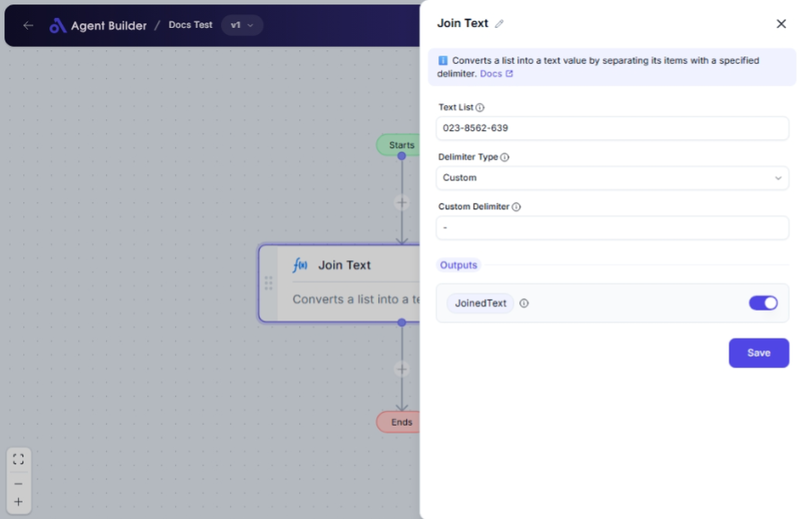

import { Callout, Steps } from "nextra/components";

# Join Text

The **Join Text** node is designed to help you combine multiple pieces of text into one cohesive string. This is especially useful when you need to format lists, create CSV files, or prepare text for consistent output with specific separators. Use this feature when you want to present multiple text items as a single string with or without separators.

{/*  */}

## Configuration Options

| Field Name             | Description                                                                                | Input Type | Required? | Default Value |
| ---------------------- | ------------------------------------------------------------------------------------------ | ---------- | --------- | ------------- |
| **Text List**          | The list of strings you wish to combine into one.                                          | Text       | Yes       | _(empty)_     |
| **Delimiter Type**     | Choose how you want the text items to be separated: Standard or Custom delimiters.         | Select     | Yes       | _(empty)_     |
| **Standard Delimiter** | Choose a predefined separator (like comma or semicolon) when Delimiter Type is 'Standard'. | Select     | No        | _(empty)_     |
| **Custom Delimiter**   | Enter your own custom separator to use between text items when Delimiter Type is 'Custom'. | Text       | No        | _(empty)_     |

## Expected Output Format

The output of this node is a **single string** that is a combination of all input text items joined together with the specified delimiter.

- The output can differ based on the delimiter used. For instance, joining ["apple", "banana", "cherry"] with a comma will result in `"apple, banana, cherry"`.

## Step-by-Step Guide

<Steps>
### Step 1

Add the **Join Text** node into your flow.

### Step 2

In the **Text List** field, list the strings that you want to combine. Ensure you separate these items correctly in your application.

### Step 3

Select a **Delimiter Type**:

- Choose **Standard** to use common symbols like Comma, Semicolon, or Pipe.
- Choose **Custom** if you have a specific character or string to separate your text.

### Step 4

If you've selected **Standard**, choose an option from **Standard Delimiter**:

- Options include: None, Comma, Semicolon, or Pipe.

### Step 5

If you selected **Custom**, enter your delimiter into the **Custom Delimiter** field.

### Step 6

The result will appear as **JoinedText**, allowing you to use this formatted string in subsequent operations.

</Steps>

<Callout type="info" title="Tip">
  Remember, selecting **Standard** or **Custom** in the Delimiter Type
  determines whether you need to fill in the Standard Delimiter or Custom
  Delimiter fields.
</Callout>

## Input/Output Examples

| Text List                      | Delimiter Type | Standard Delimiter | Custom Delimiter | Output               | Output Type |
| ------------------------------ | -------------- | ------------------ | ---------------- | -------------------- | ----------- | ------ |
| ["apple", "banana", "cherry"]  | Standard       | Comma              | _(n/a)_          | apple,banana,cherry  | String      |
| ["widget", "gadget", "device"] | Custom         | _(n/a)_            | -                | widget-gadget-device | String      |
| ["red", "blue", "green"]       | Standard       | Semicolon          | _(n/a)_          | red;blue;green       | String      |
| ["Monday", "Tuesday"]          | Standard       | Pipe               | _(n/a)_          | Monday               | Tuesday     | String |

## Common Mistakes & Troubleshooting

| Problem                            | Solution                                                                                   |
| ---------------------------------- | ------------------------------------------------------------------------------------------ |
| **Text items not separated**       | Ensure the Delimiter Type and corresponding delimiter field are correctly configured.      |
| **Custom Delimiter not working**   | Double-check that you have entered and selected 'Custom' in the Delimiter Type dropdown.   |
| **Standard options not appearing** | Options for Standard Delimiter only appear when the Delimiter Type 'Standard' is selected. |

## Real-World Use Cases

- **Email List**: Combine email addresses into a single string with commas to quickly format for mass communications.
- **Log Files**: Prepare a series of log messages or data points into a list format using delimiters such as a semicolon or pipe.
- **Data Preparation**: Format product names or categories into a CSV-ready format for easy import/export operations.
