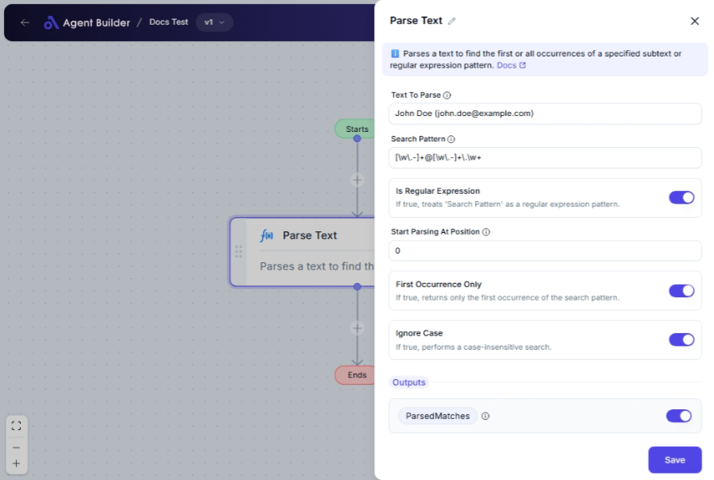

import { Callout, Steps } from "nextra/components";

# Parse Text

The **Parse Text** node allows you to search through a text value using simple text strings or more complex regular expression patterns. This is useful for extracting specific data from a long piece of text, such as finding occurrences of a particular word or pattern. Whether you're analyzing customer reviews, tracking keywords in articles, or extracting data from structured text, this node helps you efficiently find and list the matches.

## Configuration Options

| Field Name                    | Description                                                               | Input Type | Required? | Default Value |
| ----------------------------- | ------------------------------------------------------------------------- | ---------- | --------- | ------------- |
| **Text To Parse**             | The text value that will be parsed based on the specified search pattern. | Text       | Yes       | _(empty)_     |
| **Search Pattern**            | The subtext or regular expression pattern to search for.                  | Text       | Yes       | _(empty)_     |
| **Is Regular Expression**     | If true, treats 'Search Pattern' as a regular expression pattern.         | Switch     | No        | False         |
| **Start Parsing At Position** | The index at which to start parsing the text.                             | Text       | No        | 0             |
| **First Occurrence Only**     | If true, returns only the first occurrence of the search pattern.         | Switch     | No        | True          |
| **Ignore Case**               | If true, performs a case-insensitive search.                              | Switch     | No        | False         |

## Expected Output Format

The output of this node is a **list of text strings** (`ParsedMatches`) containing all occurrences of the specified search pattern found within the provided text.

- If `First Occurrence Only` is true, output will be a list with one item representing the first match (e.g., `["match1"]`).
- If multiple matches are allowed: output will be a list of strings with all matched occurrences (e.g., `["match1", "match2"]`).

## Step-by-Step Guide

<Steps>
### Step 1

Add **Parse Text** node into your flow.

### Step 2

In the **Text To Parse** field, enter the text content you want to search.

### Step 3

Enter the pattern or string to find in the **Search Pattern** field.

### Step 4

Use the **Is Regular Expression** switch if you're using a regular expression pattern for searching.

### Step 5

(Optional) Set the **Start Parsing At Position** to choose where in the text the search should begin (default is `0`).

### Step 6

Adjust the **First Occurrence Only** switch if you need only the first match.

### Step 7

Turn on **Ignore Case** if your search should be case-insensitive.

### Step 8

The resulting matches are available as **ParsedMatches** for use in subsequent nodes.

</Steps>

<Callout type="info" title="Note">
  If using complex patterns, set the **Is Regular Expression** switch to true to
  correctly interpret the **Search Pattern**.
</Callout>

## Input/Output Examples

| Text to Parse   | Search Pattern | Is Regular Expression | First Occurrence Only | Output Value          | Output Type     |
| --------------- | -------------- | --------------------- | --------------------- | --------------------- | --------------- |
| "Hello World"   | "World"        | False                 | True                  | ["World"]             | List of Strings |
| "abc ABC abc"   | "abc"          | False                 | False                 | ["abc", "abc"]        | List of Strings |
| "123, 456, 789" | "\\d+"         | True                  | False                 | ["123", "456", "789"] | List of Strings |

## Common Mistakes & Troubleshooting

| Problem                                            | Solution                                                                                                       |
| -------------------------------------------------- | -------------------------------------------------------------------------------------------------------------- |
| **No matches found**                               | Ensure the **Search Pattern** matches the text and that the **Is Regular Expression** switch is set correctly. |
| **Ignoring case but still case-sensitive results** | Verify that **Ignore Case** is enabled for case-insensitive searching.                                         |
| **Starting the search in the wrong position**      | Check the **Start Parsing At Position** setting to ensure it is set to the correct index.                      |

## Real-World Use Cases

- **Data Extraction**: Extract product codes or reference numbers embedded within emails or documents.
- **Text Analysis**: Analyze customer feedback to find frequency of specific phrases or words.
- **Log Parsing**: Search for error or specific keywords in server logs for monitoring and debugging.
- **Content Review**: Scan articles or documents for keywords to summarize or categorize content.
