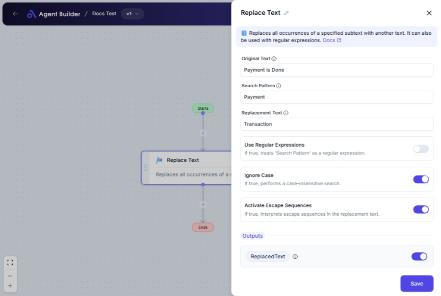

import { Callout, Steps } from "nextra/components";

# Replace Text

The **Replace Text** node allows you to modify a block of text by searching for specific characters or patterns and replacing them with new text. This is useful for correcting types, updating content dynamically, or preparing data for further processing.

For example:

- Change all occurrences of "colour" to "color" in a document.
- Replace placeholders in a greeting message with actual names.
- Use regular expressions to substitute parts of the text based on patterns.

## Configuration Options

| Field Name                    | Description                                                                         | Input Type | Required? | Default Value |
| ----------------------------- | ----------------------------------------------------------------------------------- | ---------- | --------- | ------------- |
| **Original Text**             | The original block of text you want to modify.                                      | Text       | Yes       | _(empty)_     |
| **Search Pattern**            | The specific text or pattern you wish to find and replace.                          | Text       | Yes       | _(empty)_     |
| **Replacement Text**          | The text that will replace the matched pattern.                                     | Text       | Yes       | _(empty)_     |
| **Use Regular Expressions**   | Determines if the search pattern should be treated as a regular expression.         | Switch     | No        | False         |
| **Ignore Case**               | If enabled, the search will not consider letter case (e.g., "Text" matches "text"). | Switch     | No        | False         |
| **Activate Escape Sequences** | If enabled, escape sequences in the replacement text will be interpreted.           | Switch     | No        | False         |

## Expected Output Format

The output of this node is a **text string** where all instances of the specified pattern have been replaced.

- For example, input text "Hello World" with a search pattern "World" and replacement text "Universe" will output "Hello Universe".

## Step-by-Step Guide

<Steps>
### Step 1

Add **Replace Text** node into your flow.

### Step 2

In the **Original Text** field, enter the text you wish to modify.

### Step 3

Provide the **Search Pattern**—the text or pattern you want to find in the original text.

### Step 4

In the **Replacement Text** field, enter the text that will replace the found pattern.

### Step 5

(Optionally) Enable **Use Regular Expressions** if your search pattern uses regex syntax.

### Step 6

(Optionally) Toggle **Ignore Case** to disregard letter casing during the search.

### Step 7

(Optionally) Enable **Activate Escape Sequences** if you need to interpret escape sequences in the replacement text.

### Step 8

The resulting text, after replacements, will be available as **ReplacedText** for use in other nodes.

</Steps>

<Callout type="info" title="Tip">
  Regular expressions can be powerful but tricky. Ensure your pattern is correct
  to avoid unwanted replacements.
</Callout>

## Input/Output Examples

| Original Text         | Search Pattern | Replacement Text | Use Regex | Ignore Case | Output Text          | Output Type |
| --------------------- | -------------- | ---------------- | --------- | ----------- | -------------------- | ----------- |
| "Hello World"         | "World"        | "Universe"       | False     | False       | "Hello Universe"     | Text        |
| "The Quick Brown Fox" | "quick"        | "slow"           | False     | True        | "The slow Brown Fox" | Text        |
| "123-456-7890"        | "\\d"          | "\*"             | True      | False       | "**_-_**-\*\*\*\*"   | Text        |

## Common Mistakes & Troubleshooting

| Problem                                        | Solution                                                                                                       |
| ---------------------------------------------- | -------------------------------------------------------------------------------------------------------------- |
| **No replacement occurs**                      | Ensure the search pattern matches the text exactly. Check for spaces, case sensitivity, or special characters. |
| **Forget to enable Use Regular Expressions**   | If your pattern uses regex, make sure this option is activated; otherwise, it will be treated as plain text.   |
| **Replacement includes unexpected characters** | Check if escape sequences are accidentally included; enable **Activate Escape Sequences** if necessary.        |

## Real-World Use Cases

- **Email Personalization**: Automatically replace placeholders with customer names for personalized emails.
- **Data Cleansing**: Remove unwanted spaces or format standardized data like dates or phone numbers.
- **Content Updates**: Swiftly replace old terms or phrases with updated ones across multiple document versions.
