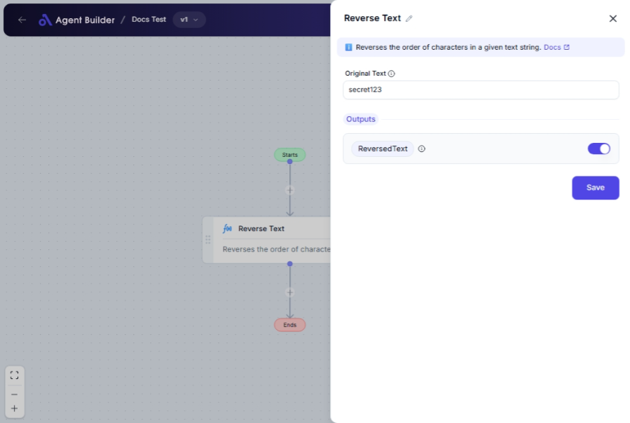

import { Callout, Steps } from "nextra/components";

# Reverse Text

The **Reverse Text** node is designed to take any text you input and reverse the order of the characters. This can be useful for creating data visualizations, encoding messages, or simply formatting text differently for various applications.

For example:

- Reversing the text "Hello" will produce "olleH".
- Useful for backwards message encoding or playful text formatting.

## Configuration Options

| Field Name        | Description                                                          | Input Type | Required? | Default Value |
| ----------------- | -------------------------------------------------------------------- | ---------- | --------- | ------------- |
| **Original Text** | The text you wish to reverse. For instance, "Hello" becomes "olleH". | Text       | Yes       | _(empty)_     |

## Expected Output Format

The output from this node is a **single string** where all characters from the original text are in reverse order.

- Output type: **String**
- Example: Input "World" results in output "dlroW".

## Step-by-Step Guide

<Steps>
### Step 1

Add the **Reverse Text** node to your workflow.

### Step 2

In the **Original Text** field, enter the text you want to reverse. Ensure it's accurate as this is the text that will be processed.

### Step 3

Once the text is entered, the reversed version will automatically be processed and stored as **ReversedText**.

</Steps>

<Callout type="info" title="Tip">
  You can use reversed text creatively in multiple scenarios, such as data
  entry, secret message creation, or entertainment.
</Callout>

## Input/Output Examples

| Original Text | Reversed Text | Output Type |
| ------------- | ------------- | ----------- |
| "Hello"       | "olleH"       | String      |
| "Data"        | "ataD"        | String      |

## Common Mistakes & Troubleshooting

| Problem              | Solution                                                                                                                            |
| -------------------- | ----------------------------------------------------------------------------------------------------------------------------------- |
| **Empty output**     | Ensure you've entered text in the **Original Text** field. The input is mandatory for the node to generate an output.               |
| **Non-text entries** | The **Original Text** field requires valid text input. Numbers and special characters will be reversed as they appear in the input. |

## Real-World Use Cases

- **Interactive Games**: Use reversed text for fun puzzles or game challenges.
- **Text Processing**: Incorporate in workflows to transform user-generated content in creative ways.
- **Data Obfuscation**: Reverse sensitive text for simple, temporary obfuscation before more secure processing.
