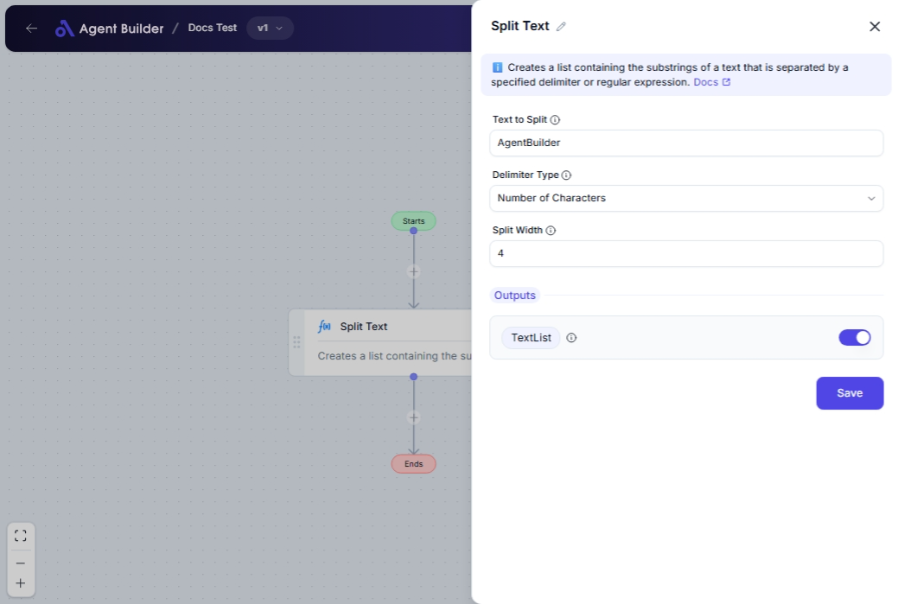

import { Callout, Steps } from "nextra/components";

# Split Text

The **Split Text** node allows you to divide a text string into a list of smaller pieces (substrings) based on different delimiter options. It's helpful when you need to analyze or manipulate parts of a string separately, such as separating words, sentences, or specific data entries.

For example:

- Splitting text by standard characters like tabs or newlines.
- Dividing a long string into equally sized chunks.
- Using custom delimiters, even complex patterns with regex.

## Configuration Options

| Field Name                | Description                                                                               | Input Type | Required? | Default Value |
| ------------------------- | ----------------------------------------------------------------------------------------- | ---------- | --------- | ------------- |
| **Text to Split**         | The text value that will be split into parts based on the specified delimiter or pattern. | Text       | Yes       | _(empty)_     |
| **Delimiter Type**        | Specifies how to split the text.                                                          | Select     | Yes       | _(empty)_     |
| **Standard Delimiter**    | The standard delimiter to use when 'Delimiter Type' is 'Standard'.                        | Select     | No        | _(empty)_     |
| **Times**                 | The number of times to split the text using the standard delimiter.                       | Text       | No        | _(empty)_     |
| **Split Width**           | The width of each substring when 'Delimiter Type' is 'Number of Characters'.              | Text       | No        | _(empty)_     |
| **Custom Delimiter**      | The custom delimiter to use when 'Delimiter Type' is 'Custom'.                            | Text       | No        | _(empty)_     |
| **Is Regular Expression** | Indicates whether the custom delimiter is a regular expression pattern.                   | Switch     | No        | _(empty)_     |

## Expected Output Format

The output of this node is a **list of text strings**. After processing, the original text is split into an array of substrings.

- The output, known as **Text List**, is a collection of strings (e.g., `["Hello", "World"]`).

## Step-by-Step Guide

<Steps>
### Step 1

Add **Split Text** node into your flow.

### Step 2

In the **Text to Split** field, input the text you wish to divide.

### Step 3

Select the **Delimiter Type** from the dropdown:

- **Standard**: Choose for common delimiters like Tab or New Line.
- **Number of Characters**: Define a fixed width for split segments.
- **Custom**: Specify a unique delimiter, supporting regex if needed.

### Step 4

If you select **Standard**, choose a **Standard Delimiter**:

- **Tab**: Splits by tab characters.
- **New Line**: Splits by newline symbols.

Also, specify a **Times** value if you need repeated splits with a standard delimiter.

### Step 5

If you select **Number of Characters**, fill in the **Split Width** to define chunk size.

### Step 6

If you select **Custom**, enter your **Custom Delimiter**. Toggle **Is Regular Expression** if using regex patterns.

### Step 7

The divided text parts will be output as **Text List** for use in subsequent nodes.

</Steps>

<Callout type="info" title="Note">
  The **Standard Delimiter**, **Times**, **Split Width**, **Custom Delimiter**,
  and **Is Regular Expression** fields will only appear based on your selected
  **Delimiter Type**.
</Callout>

## Input/Output Examples

| Delimiter Type       | Input Text      | Split Value Specification                         | Output Value        | Output Type |
| -------------------- | --------------- | ------------------------------------------------- | ------------------- | ----------- |
| Standard - Tab       | "Hello\tWorld"  | Tab                                               | ["Hello", "World"]  | Text List   |
| Standard - New Line  | "Hello\nWorld"  | New Line, Times: 1                                | ["Hello", "World"]  | Text List   |
| Number of Characters | "HelloWorld"    | Split Width: 5                                    | ["Hello", "World"]  | Text List   |
| Custom               | "Hello, World!" | Custom Delimiter: ", "                            | ["Hello", "World!"] | Text List   |
| Custom (Regex)       | "Hello1World"   | Custom Delimiter: \d, Is Regular Expression: true | ["Hello", "World"]  | Text List   |

## Common Mistakes & Troubleshooting

| Problem                            | Solution                                                                                     |
| ---------------------------------- | -------------------------------------------------------------------------------------------- |
| **Delimiter Type not selected**    | Ensure you choose a delimiter type from the dropdown to reveal corresponding fields.         |
| **Incorrect or unexpected splits** | Double-check delimiter selection and related settings (e.g., regex accuracy).                |
| **No output generated**            | Confirm that 'Text to Split' contains a valid entry and is paired with appropriate settings. |

## Real-World Use Cases

- **CSV Parsing**: Split comma-separated values into list entries for easy processing.
- **Text Analysis**: Divide lengthy paragraphs into sentences by newline for clearer insights.
- **Batch Processing**: Break extensive text data into fixed-size chunks for systematic operations.
