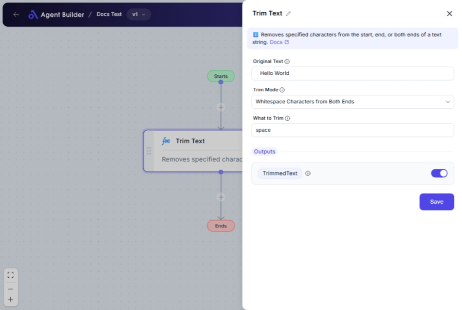

import { Callout, Steps } from "nextra/components";

# Trim Text

The **Trim Text** node is designed to modify text strings by removing unwanted characters from the start, end, or both ends. This is particularly useful for cleaning up text input, preparing data for further processing, or ensuring consistency in text data across different systems and applications.

For example, you might use it to:

- Remove extra spaces from user input.
- Clean up text data imported from external sources.
- Format text by removing specific unwanted characters.

{/*  */}

## Configuration Options

| Field Name        | Description                                                                              | Input Type | Required? | Default Value |
| ----------------- | ---------------------------------------------------------------------------------------- | ---------- | --------- | ------------- |
| **Original Text** | The original text from which characters will be trimmed.                                 | Text       | Yes       | _(empty)_     |
| **Trim Mode**     | Specifies whether to trim characters from the beginning, end, or both sides of the text. | Select     | Yes       | TrimBoth      |
| **What to Trim**  | A string containing the characters to remove. Leave empty to trim only whitespace.       | Text       | Yes       | _(empty)_     |

## Expected Output Format

The output of this node is a **text string** with specified characters removed from the designated places.

- For trimming operations, output will be the modified text string (e.g., `"hello world"` becomes `"hello world"` after whitespace removal from both ends).

## Step-by-Step Guide

<Steps>
### Step 1

Add **Trim Text** node into your flow.

### Step 2

In the **Original Text** field, enter or select the text string you want to format.

### Step 3

For **Trim Mode**, choose one of the following options from the dropdown:

- **Whitespace Characters from the Beginning**: Removes characters from the start.
- **Whitespace Characters from the End**: Removes characters from the end.
- **Whitespace Characters from Both Ends**: Removes characters from both ends.

### Step 4

In **What to Trim**, specify the characters you want to remove. Leave this field blank to only remove spaces, tabs, and newlines.

### Step 5

The processed text will be available as **TrimmedText** for use in subsequent nodes or actions.

</Steps>

<Callout type="info" title="Tip">
  Leaving the **What to Trim** field empty will default to trimming whitespace
  characters like spaces, tabs, and newlines.
</Callout>

## Input/Output Examples

| Trim Mode                                | Original Text      | What to Trim | Output Value   | Output Type |
| ---------------------------------------- | ------------------ | ------------ | -------------- | ----------- |
| Whitespace Characters from the Beginning | " hello world"     | _(empty)_    | "hello world"  | Text        |
| Whitespace Characters from the End       | "hello world "     | _(empty)_    | "hello world"  | Text        |
| Whitespace Characters from Both Ends     | " example text "   | _(empty)_    | "example text" | Text        |
| Whitespace Characters from Both Ends     | "--example text--" | "-"          | "example text" | Text        |

## Common Mistakes & Troubleshooting

| Problem                                     | Solution                                                                                         |
| ------------------------------------------- | ------------------------------------------------------------------------------------------------ |
| **Characters are not trimming as expected** | Ensure you specify the correct trim mode and the characters to remove.                           |
| **Whitespace not removed**                  | Verify there is no accidental input in **What to Trim** if you intend only to remove whitespace. |

## Real-World Use Cases

- **Form Input Validation**: Ensure all user input is consistent by removing leading and trailing whitespace.
- **Data Cleanup**: Import text data from external sources and clean it by removing unwanted characters.
- **Text Formatting**: Standardize text data by trimming consistent characters across datasets or documents.
