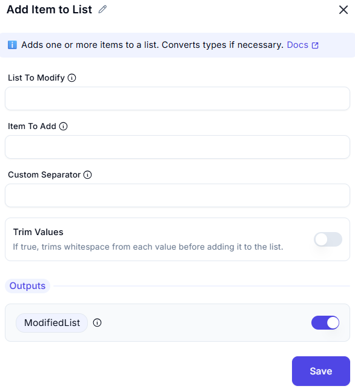

# Add Item to List  

## Description

This feature allows users to add an item to a list. It is useful for dynamically updating lists during automation workflows.  

  

## Fields and Options  

### 1. **List To Modify**

- **Description**: Specify the list which need to modified.  
- **Purpose**: This ensures the correct list is added.  

### 2. **Item To Add**

- **Description**: Select the list to which the item will be added.  
- **Purpose**: This ensures the item is added to the correct list.  

### 3. **Custom Separator**

- **Description**: Optional. If provided, splits the input using this separator instead of default ones (',', ';', '|').
- **Purpose**: This ensures the correct separator is added. 

### 4. **Trim Values**

- **Description**: If true, trims whitespace from each value before adding it to the list.  
- **Purpose**: To trim the values if required. 

## Output Variable:
 - Output variable returns the updated list after items have been added.

## Use Cases

- **List Management**: Dynamically updating lists with new items.  
- **Workflow Automation**: Integrating list updates into larger automation workflows.  
- **Data Collection**: Adding items to a list for further processing or analysis.  

## Summary

The **Add Item to List** action provides a way to add an item to a specified list. It ensures efficient list management, making it ideal for automation workflows involving dynamic data updates.