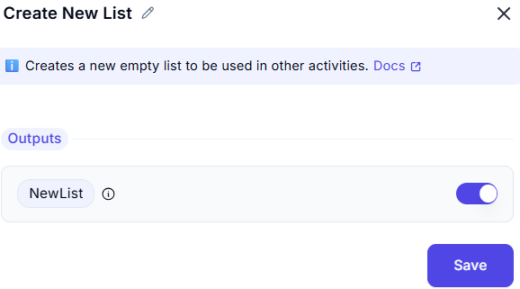

## Create New List

This UI allows users to initialize a new list object that can be used in workflows or data operations.

---

### List Configuration

- **Label:** `List`
- **Description:** Represents the new list to be created and used.
- **Toggle Switch:** Enables or disables the creation of the list.
- **Default State:** Toggled **On** (enabled).

---

### Functionality

This feature is typically used to:
- Create an empty list to be populated later.
- Define a list variable for use in conditions, loops, or data manipulations.

---

### Example Use Case

You might use the "Create New List" option as a setup step before:
- Appending values dynamically
- Storing filtered data
- Collecting input values from user forms

---

### Notes

- No initial items are required — this list is initialized as empty.
- Lists created here are often used in automation flows or conditional branches.
