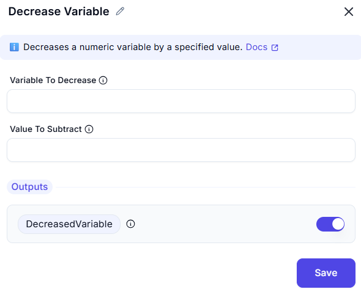

# Decrease Variable

## Description

This operation is used to decrement the value of a specified variable by a given amount. It is useful in scenarios where counters or iterative operations require reduction.

## Input

- **Variable To Decrease**: The numeric variable that will be decreased.  
  - Example: `counter`
  
- **Value To Substract**: The amount to subtract from the variable. Can be a number or another variable containing a number.  
  - Example: `2`

## Output

- The specified variable (`DecreasedVariable`) will returns the resulting value after decreasing the variable.