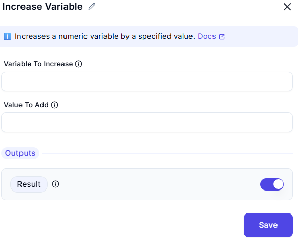

# Increase Variable

## **Description**

This operation increments the value of a specified variable by a given amount. It is useful for counting, tracking progress, or managing numerical values dynamically.  

## **Inputs**

- **Variable To Increase**: The name of the variable whose value will be increased.  
  - Example: `counter`  

- **Value To Add**: The amount by which the variable's value should be increased.  
  - Example: `1`  

### **Outputs**

- The value of the variable (`Result`) will be increased by the specified amount (`1`).  

### Example
- If `counter` was `5`, it will now be `6`.  