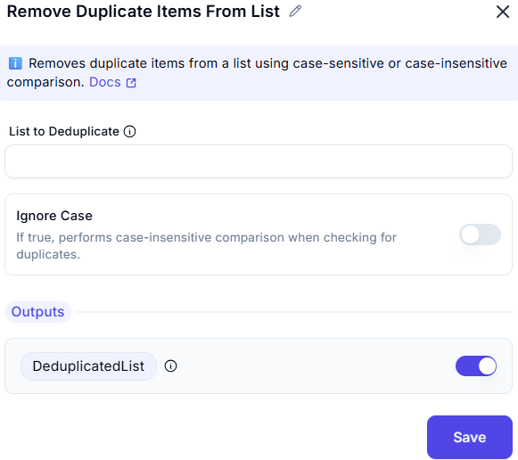

# Remove Duplicate Items from List  

## Description

The **Remove Duplicate Items from List** feature allows users to streamline a list by eliminating duplicate entries, ensuring that only unique values remain.  

---  

## Configuration Options

- **List to Deduplicate** 
  - Specifies the list from which duplicate values will be removed.  

- **Ignore Text Case**
  - Defines whether the duplicate check should be case-sensitive (`No`) or case-insensitive (`Yes`).  

- **Outputs** 
  - **Deduplicate** Returns the list after removing duplicate items.
---  

## Input & Output Examples  

| **Input List**              | **Ignore Text Case** | **Output (Duplicates Removed)** |
|-----------------------------|----------------------|---------------------------------|
| `[1, 2, 2, 3, 4, 4, 5]`     | No                   | `[1, 2, 3, 4, 5]`              |
| `['A', 'B', 'a', 'C', 'b']` | No                   | `['A', 'B', 'a', 'C', 'b']`    |
| `['A', 'B', 'a', 'C', 'b']` | Yes                  | `['A', 'B', 'C']`              |
| `[True, False, True]`       | No                   | `[True, False]`                |

---  

## Summary

This functionality is especially beneficial for **data cleaning**, **removing duplicate values**, and **maintaining data integrity** in various use cases.  