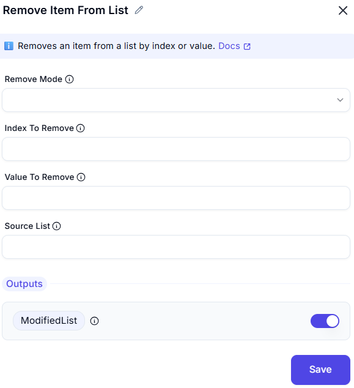

# Remove Item from List  

## Description

The **Remove Item from List** feature enables users to remove a specific element from a list based on the selected criteria.  

---  

### Configuration Input/Output Options  

- **Remove Mode** 
  - Specifies whether to remove by Index or Value.

- **Index To Remove**
  - The zero-based index of the item to remove.

- **Value To Remove**
  - The value of the item to remove from the list.

- **Source List**
  - The list from which the item will be removed

- **Outputs**
  - `ModifiedList` Returns the updated list after removing the item(s).

### Input & Output Example  

| **Input List**       | **Remove Items By** | **Value/Index** | **Output List**     |
|----------------------|--------------------|----------------|---------------------|
| `[10, 20, 30, 40]`  | Index              | `2`            | `[10, 20, 40]`     |
| `['A', 'B', 'C']`   | Value              | `'B'`          | `['A', 'C']`       |
| `[True, False, True]` | Index            | `0`            | `[False, True]`    |

---  

## Summary

This feature is particularly useful for **list modifications**, **removing unwanted elements**, and **dynamic list management**.  