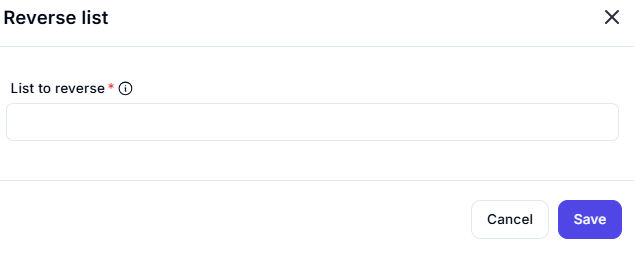

## Reverse List 

The **"Reverse list"** form allows users to input a list variable and reverse the order of its elements. This feature is typically used in automation workflows or data processing pipelines.

---

### Input/Outputs Field

- **List to reverse**
  - The list whose item order will be reversed

- **Outputs**
  - **ReversedList** Returns the list after reversing the order of its items.
---

### Use Case

Reversing a list is useful when:
- You want to process items from last to first.
- Sorting operations need to be undone.
- You are manipulating sequences (like logs, queues, or batches) where order matters.

This interface provides a clean, minimal setup, ensuring users can quickly apply the reverse operation with minimal configuration.

