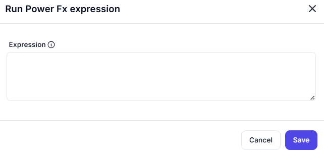

## Run Power Fx Expression - Interface Overview

This interface enables users to write and evaluate Power Fx expressions dynamically within a workflow or automation context.



---

### Expression Field

- **Label:** `Expression`
- **Type:** Multi-line Text Input
- **Tooltip (ⓘ):** Offers guidance or format hints for writing Power Fx expressions.
- **Purpose:** Enter a valid Power Fx formula to compute or manipulate data.
- **Example Expressions:**
  ```powerfx
  Text(Today(), "yyyy-mm-dd")


###  Use Case
Use this form when you need to:
- Perform calculations or logical evaluations.
- Format dates, strings, or numbers using Power Fx syntax.
- Dynamically drive logic in low-code workflows or apps.

