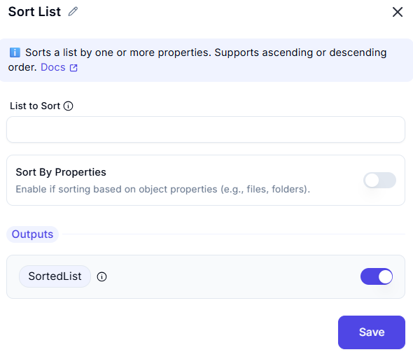

# Sort List  

## Description

The **Sort List** feature enables users to arrange the elements of a list in a specified order, either in ascending or descending sequence.  

---  

## Configuration Options  

- **List to Sort**
  - Specifies the list that needs to be sorted.  

- **Sort by Properties** 
  - If the list contains objects (such as files, folders, etc.), enabling this option allows sorting by a specific property.  
  - If disabled, the elements will be sorted by their default property (e.g., file objects will be sorted by their full path).  

- **Outputs**
  - The sorted version of the input list saved into variable- **SortedList**.  

---  

## Input & Output Example  

| **Input List**                     | **Sort Order** | **Output List**                |
|--------------------------------------|---------------|--------------------------------|
| `[4, 2, 9, 1]`                      | Ascending     | `[1, 2, 4, 9]`                 |
| `['Banana', 'Apple', 'Cherry']`     | Ascending     | `['Apple', 'Banana', 'Cherry']`|
| `['Banana', 'Apple', 'Cherry']`     | Descending    | `['Cherry', 'Banana', 'Apple']`|
| `[{'name': 'FileB'}, {'name': 'FileA'}]` | Ascending | `[{'name': 'FileA'}, {'name': 'FileB'}]` |

---  

## Summary

This feature is useful for **organizing data**, **sorting numerical values**, and **arranging structured lists** efficiently.  