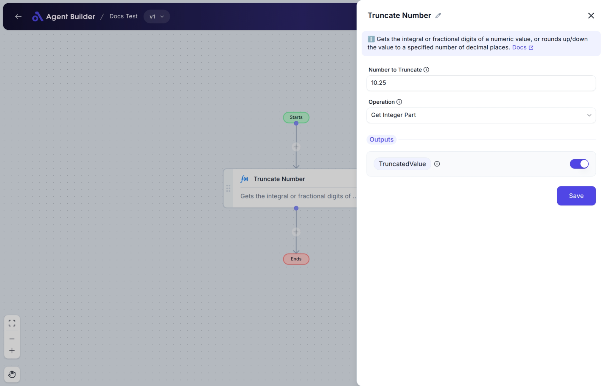

import { Callout, Steps } from "nextra/components";

# Truncate Number

The **Truncate Number** node allows you to adjust a numeric value by either removing its decimal (fractional) part, keeping only its fractional part, or rounding it to a specified number of decimal places. This is useful when you want to clean or control the format of number data before using it in calculations, reports, or outputs.

For example:

- Removing decimals to get only the whole number (integer).
- Extracting just the decimal part for further processing.
- Rounding numbers to a desired number of decimal places for display or consistency.

## Configuration Options

| Field Name             | Description                                                                            | Input Type | Required? | Default Value  |
| ---------------------- | -------------------------------------------------------------------------------------- | ---------- | --------- | -------------- |
| **Number to Truncate** | The numeric value you want to modify (truncate or round).                              | Text       | Yes       | _(empty)_      |
| **Operation**          | Choose how you want to adjust the number: get integer part, fractional part, or round. | Select     | Yes       | GetIntegerPart |
| **Decimal Places**     | The number of decimal places to round to. _Only appears if Operation is "Round"._      | Text       | No        | 2              |
| **Round Operation**    | Decide if rounding should go up or down. _Only appears if Operation is "Round"._       | Select     | No        | RoundUp        |

## Expected Output Format

The output of this node is a **single number value** (without text or other data types).

- If you extract the integer part: output will be an integer (e.g., `15`).
- If you extract the fractional part: output will be a decimal number between `0` and `1` (e.g., `0.75`).
- If you round the number: output will be a decimal number rounded to the specified places (e.g., `15.68`).

## Step-by-Step Guide

<Steps>
### Step 1

Add **Truncate Number** node into your flow.

### Step 2

In the **Number to Truncate** field, enter the number you want to modify.

### Step 3

In the **Operation** dropdown, select how you want to process the number:

- **Get Integer Part**: Keeps only the whole number, removes decimals.
- **Get Fractional Part**: Keeps only the decimal part.
- **Round**: Rounds the number to a set number of decimal places.

### Step 4

If you chose **Round**, additional fields will appear:

- **Decimal Places**: Enter how many decimal places to keep (default: 2).
- **Round Operation**: Choose whether to round up or down.

### Step 5

The processed number will be available as **TruncatedValue** for use in other nodes.

</Steps>

<Callout type="info" title="Tip">
  If you do not select "Round" in the **Operation** dropdown, the "Decimal
  Places" and "Round Operation" fields will not appear.
</Callout>

## Input/Output Examples

| Operation           | Input Number | Decimal Places | Round Operation | Output Value | Output Type      |
| ------------------- | ------------ | -------------- | --------------- | ------------ | ---------------- |
| Get Integer Part    | 15.75        | _(n/a)_        | _(n/a)_         | 15           | Number (Integer) |
| Get Fractional Part | 15.75        | _(n/a)_        | _(n/a)_         | 0.75         | Number (Decimal) |
| Round (Up)          | 15.756       | 2              | RoundUp         | 15.76        | Number (Decimal) |
| Round (Down)        | 15.756       | 2              | RoundDown       | 15.75        | Number (Decimal) |

## Common Mistakes & Troubleshooting

| Problem                                               | Solution                                                                                                                                                       |
| ----------------------------------------------------- | -------------------------------------------------------------------------------------------------------------------------------------------------------------- |
| **Decimal Places and Round Operation not showing up** | Make sure you selected **"Round"** in the Operation dropdown. These fields only appear when rounding is chosen.                                                |
| **Non-numeric value entered in Number to Truncate**   | The input must be a number. Avoid entering text like "abc" or symbols.                                                                                         |
| **Unexpected rounding result**                        | Double-check the Decimal Places and Round Operation settings. For example, rounding `15.756` to 2 decimal places with "Round Down" gives `15.75`, not `15.76`. |

## Real-World Use Cases

- **Invoice Totals**: Remove decimal points from invoice totals for clean display (e.g., `125.99` → `125`).
- **Tax Calculations**: Extract just the decimal portion of prices for tax or fee processing (e.g., `15.75` → `0.75`).
- **Financial Reports**: Round financial figures to 2 decimal places for consistency in reports.
- **Product Pricing**: Round up prices to ensure they meet minimum pricing rules.
