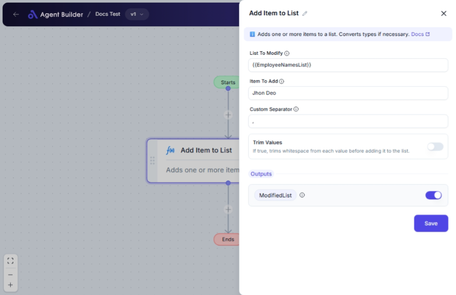

import { Callout, Steps } from "nextra/components";

# Add Item to List

The **Add Item to List** node helps you efficiently manage and update list data within your workflow. By using this node, you can easily append items to an existing list, supporting various formats for input and offering customization on how items are separated and cleaned before adding them.

Here’s when you might want to use it:

- When accumulating data increments over time.
- When aggregating multiple user inputs or data sources into a single list.
- When you need to manipulate data for later processing or reporting.

{/*  */}

## Configuration Options

| Field Name           | Description                                                                                       | Input Type | Required? | Default Value |
| -------------------- | ------------------------------------------------------------------------------------------------- | ---------- | --------- | ------------- |
| **List To Modify**   | The list variable to which new elements will be added.                                            | Text       | Yes       | _(empty)_     |
| **Item To Add**      | A single item or comma-separated values to add to the list.                                       | Text       | Yes       | _(empty)_     |
| **Custom Separator** | Optional. If provided, splits the input using this separator instead of default ones (`,`, `;`, ` | `).        | Text      | No            |
| **Trim Values**      | If true, trims whitespace from each value before adding it to the list.                           | Switch     | No        | False         |

## Expected Output Format

The output of this node will be a **list of items** containing the newly added entries as part of the list.

- For example, if initially `[1, 2, 3]` and `4` is added, the output will be `[1, 2, 3, 4]`.

## Step-by-Step Guide

<Steps>
### Step 1

Add **Add Item to List** node into your flow.

### Step 2

In the **List To Modify** field, enter the existing list you wish to append items to.

### Step 3

In the **Item To Add** field, specify the item(s) you want to add. Use commas to separate multiple items.

### Step 4

(Optional) In **Custom Separator**, enter a custom character to separate items if not using default separators (`,`, `;`, `|`).

### Step 5

(Optional) Enable **Trim Values** if you want to remove any leading or trailing spaces from the items before adding them.

### Step 6

Your updated list will be available as **ModifiedList** for further use in other nodes.

</Steps>

<Callout type="info" title="Tip">
  Using a **Custom Separator** can be particularly useful when your data
  contains commas or other default delimiters.
</Callout>

## Input/Output Examples

| Input List | Item to Add   | Custom Separator | Trim Values | Output List          | Output Type  |
| ---------- | ------------- | ---------------- | ----------- | -------------------- | ------------ |
| [1, 2, 3]  | 4             | _(n/a)_          | False       | [1, 2, 3, 4]         | List         |
| ["a", "b"] | "c,d"         | _(n/a)_          | True        | ["a", "b", "c", "d"] | List         |
| [100, 200] | " 300 ; 400 " | ;                | True        | [100, 200, 300, 400] | List         |
| []         | ""            | _(n/a)_          | _(any)_     | []                   | List (Empty) |

## Common Mistakes & Troubleshooting

| Problem                                        | Solution                                                                                                                            |
| ---------------------------------------------- | ----------------------------------------------------------------------------------------------------------------------------------- |
| **Items Not Adding As Expected**               | Make sure to use the **Custom Separator** field if your items contain default separators like commas.                               |
| **Whitespace Causing Issues**                  | Enable **Trim Values** to automatically remove spaces from around each item.                                                        |
| **Empty List Resulting from Incorrect Inputs** | Double-check the **Item To Add** and ensure it is not empty or affected by an unintended separator; verify **List To Modify** data. |

## Real-World Use Cases

- **Customer Orders**: Append new product IDs to an order list dynamically.
- **Task Tracking**: Add tasks to a team task list where tasks are entered individually by team members.
- **Feedback Collection**: Aggregate feedback entries from users directly into a single list for analytics.
- **Inventory Management**: Update lists of stock items automatically as new products are logged into the system.
