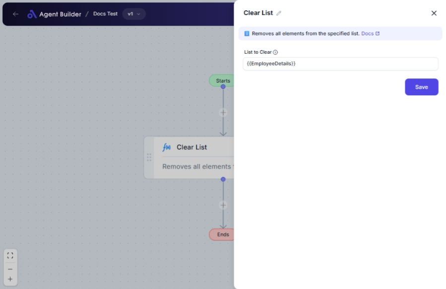

import { Callout, Steps } from "nextra/components";

# Clear List

The **Clear List** node allows you to completely empty a list by removing all its elements. This is useful when you need to reset or reuse a list variable without any prior elements, ensuring that future operations start with an empty list.

Common scenarios include:

- Reinitializing a list to collect new data.
- Ensuring past data does not interfere with new processes.

{/*  */}

## Configuration Options

| Field Name        | Description                                       | Input Type | Required? | Default Value |
| ----------------- | ------------------------------------------------- | ---------- | --------- | ------------- |
| **List to Clear** | The list variable whose elements will be removed. | Text       | Yes       | _(empty)_     |

## Expected Output Format

The output of this node is an **empty list**, indicated by `[]`.

## Step-by-Step Guide

<Steps>
### Step 1

Add **Clear List** node into your flow.

### Step 2

In the **List to Clear** field, specify the name of the list variable you want to clear. This step is crucial as it determines which list will be emptied.

### Step 3

Once the node processes the instruction, the specified list variable will be cleared of all elements, effectively turning it into an empty list `[]`.

</Steps>

<Callout type="note" title="Note">
  Ensure the list variable entered is correctly spelled and defined in your
  flow, otherwise the node won’t function as intended.
</Callout>

## Input/Output Examples

| Input List            | Output List |
| --------------------- | ----------- |
| `[1, 2, 3, 4, 5]`     | `[]`        |
| `['apple', 'banana']` | `[]`        |
| `[true, false, true]` | `[]`        |

## Common Mistakes & Troubleshooting

| Problem                         | Solution                                                                                   |
| ------------------------------- | ------------------------------------------------------------------------------------------ |
| **List remains unchanged**      | Make sure the list variable name is correctly entered in the **List to Clear** field.      |
| **Clearing unintended list**    | Double-check the list variable name to ensure you are targeting the correct list to clear. |
| **Error due to undefined list** | Verify that the list variable you want to clear is defined and initialized in your flow.   |

## Real-World Use Cases

- **Data Refresh**: Clear a list storing temporary data before fetching the latest updates.
- **User Session Management**: Empty session-specific lists when initializing a new user session in an application.
- **Reset Data Collections**: Prepare lists for fresh data aggregation tasks by clearing old data first.
