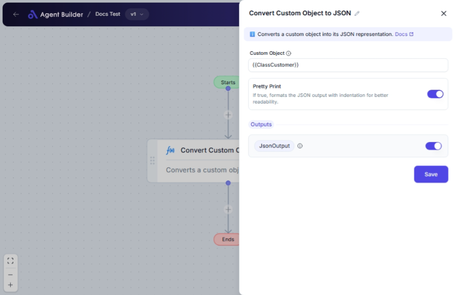

import { Callout, Steps } from "nextra/components";

# Convert Custom Object to JSON

The **Convert Custom Object to JSON** node is essential for transforming structured data from custom formats into JSON, a widely-used data interchange format. This node is particularly useful for converting data objects that you wish to store, transfer, or use in web-based applications that require JSON format.

This node helps you by:

- Converting complex data structures into JSON strings.
- Formatting JSON data for readability if you need to visualize or present it.

## Configuration Options

| Field Name        | Description                                                                 | Input Type | Required? | Default Value |
| ----------------- | --------------------------------------------------------------------------- | ---------- | --------- | ------------- |
| **Custom Object** | The custom object to convert to JSON.                                       | Text       | Yes       | _(empty)_     |
| **Pretty Print**  | If enabled, the JSON output will be formatted with indentation for clarity. | Switch     | No        | True          |

## Expected Output Format

The output from this node is a **string** that represents the JSON-formatted version of the provided custom object.

- If **Pretty Print** is enabled, the output will be a human-readable JSON with indentation.
- Otherwise, it will be a compact JSON string without extra spaces or line breaks.

## Step-by-Step Guide

<Steps>
### Step 1

Add the **Convert Custom Object to JSON** node to your flow.

### Step 2

In the **Custom Object** field, enter the data you want to convert into JSON format.

### Step 3

If you want the JSON output to be more readable, switch on the **Pretty Print** option. This adds formatting and indentation to the JSON.

### Step 4

The resulting JSON string will be available as **JsonOutput** for further use or output in your automation process.

</Steps>

<Callout type="info" title="Note">
  By default, the **Pretty Print** option is enabled, ensuring your JSON is easy
  to read. However, you can disable this if you need a more compact JSON format.
</Callout>

## Input/Output Examples

| Custom Object Input                 | Pretty Print | JSON Output                                  | Output Type |
| ----------------------------------- | ------------ | -------------------------------------------- | ----------- |
| `{"name": "Widget", "price": 20.5}` | True         | `{\n  "name": "Widget",\n  "price": 20.5\n}` | String      |
| `{"name": "Widget", "price": 20.5}` | False        | `{"name":"Widget","price":20.5}`             | String      |

## Common Mistakes & Troubleshooting

| Problem                                    | Solution                                                                                                  |
| ------------------------------------------ | --------------------------------------------------------------------------------------------------------- |
| **Non-valid input in Custom Object field** | Ensure that the input is a structured object or a correctly formatted text string representing an object. |
| **JSON output is too compact**             | Enable **Pretty Print** to format the JSON for better readability.                                        |
| **Output not appearing**                   | Check that the node is appropriately connected and the data input is correct.                             |

## Real-World Use Cases

- **Data Storage**: Convert user profiles or product data into JSON for storage in databases or files.
- **API Requests**: Prepare data to be sent as JSON in API requests, essential for web integrations.
- **Data Transport**: Share structured information between systems in a universal format that is easily parsed.
