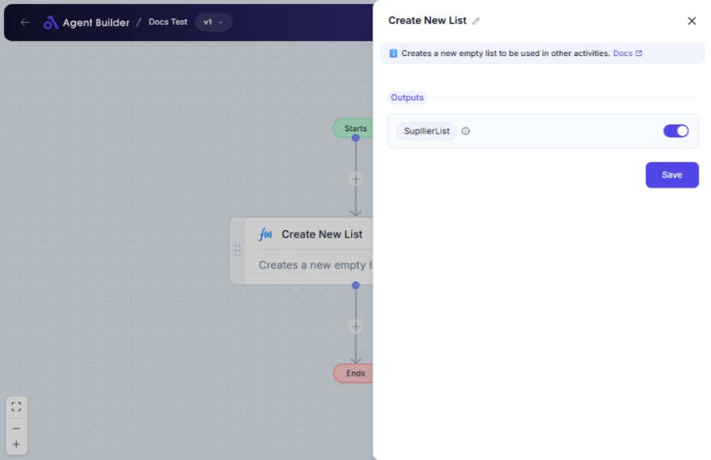

import { Callout, Steps } from "nextra/components";

# Create New List

The **Create New List** node allows you to generate an empty list or collection that you can later populate with items. This node is useful as a starting point when you need to gather, sort, or analyze data dynamically. Lists are often used to organize data points for processing, aggregation, or conditional workflows.

Some examples of uses include preparing to store data inputs, cataloging items, or setting up placeholders for incoming data.

## Configuration Options

| Field Name | Description                                                                                        | Input Type | Required? | Default Value |
| ---------- | -------------------------------------------------------------------------------------------------- | ---------- | --------- | ------------- |
| New List   | The newly created empty list. It acts as a placeholder for you to populate later in your workflow. | Output     | No        | NewList       |

## Expected Output Format

The output of this node is an **empty list**. The list is an open object intended for future insertion of data, elements, or other nodes.

## Step-by-Step Guide

<Steps>
### Step 1

Add the **Create New List** node to your flow.

### Step 2

The node will automatically create an empty list labeled **New List**. This serves as a container you can add items to in upcoming steps of your workflow.

### Step 3

Proceed with nodes that insert, append, or process data into the list if needed. The list starts empty and should be populated according to your data processing needs.

### Step 4

Utilize the **New List** output wherever a list is required in your automation or other analytical processes.

</Steps>

<Callout type="info" title="Note">
  The **New List** can be dynamically updated throughout your process. This
  flexibility allows different steps to interactively add or operate on the
  list.
</Callout>

## Input/Output Examples

- **Initial State**: `[]` - The empty list created upon node activation.
- **Populated Example**: `['item1', 'item2']` - Items added with further data operations.

## Common Mistakes & Troubleshooting

| Problem                                          | Solution                                                                       |
| ------------------------------------------------ | ------------------------------------------------------------------------------ |
| **The list remains empty after data operations** | Verify that subsequent nodes are set up correctly to add items to the list.    |
| **Node not creating expected output**            | Ensure the node is correctly connected in your workflow for expected outcomes. |

## Real-World Use Cases

- **Data Collection**: Initiating data gathering processes where multiple data points are organized into one entity for analysis.
- **Batch Processing**: Grouping related data points to apply bulk operations such as updates, deletions, or condition-based sorting.
- **Task Management**: Compiling tasks over a period for task-oriented projects, enabling updates, modifications, and reviews.
- **Dynamic Lists**: Building lists in interactive environments that react and change based on user input or processing requirements.
