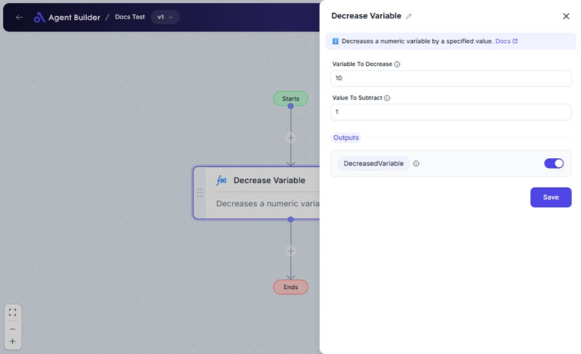

import { Callout, Steps } from "nextra/components";

# Decrease Variable

The **Decrease Variable** node allows you to reduce a numeric variable by subtracting a specified amount. This is useful for scenarios where you need to decrement a value, such as adjusting budgets, stock levels, or other numeric records.

For example, you might use this node to:

- Subtract expenses from a total budget.
- Deduct sales from product inventory.
- Reduce a countdown or timer.

## Configuration Options

| Field Name               | Description                                                              | Input Type | Required? | Default Value |
| ------------------------ | ------------------------------------------------------------------------ | ---------- | --------- | ------------- |
| **Variable To Decrease** | The numeric variable that will be decreased.                             | Text       | Yes       | _(empty)_     |
| **Value To Subtract**    | The amount to subtract from the variable. Can be a number or a variable. | Text       | Yes       | _(empty)_     |

## Expected Output Format

The output of this node is a **single number value** representing the decreased result.

## Step-by-Step Guide

<Steps>
### Step 1

Add **Decrease Variable** node into your flow.

### Step 2

In the **Variable To Decrease** field, enter the name of the variable you want to decrease. Ensure this is a numeric value or a variable holding a number.

### Step 3

In the **Value To Subtract** field, enter the number you wish to subtract, or input a variable name that contains the number to be subtracted.

### Step 4

The result will be available as **DecreasedVariable** for use in other nodes.

</Steps>

<Callout type="info" title="Tip">
  Make sure the variable you want to decrease and the subtraction value are both
  numeric to avoid errors.
</Callout>

## Input/Output Examples

| Variable To Decrease | Value To Subtract | Output Value | Output Type      |
| -------------------- | ----------------- | ------------ | ---------------- |
| 100                  | 25                | 75           | Number (Integer) |
| 50.75                | 10.50             | 40.25        | Number (Decimal) |
| 200                  | Variable Y (50)   | 150          | Number (Integer) |

## Common Mistakes & Troubleshooting

| Problem                                   | Solution                                                                            |
| ----------------------------------------- | ----------------------------------------------------------------------------------- |
| **Non-numeric variable or value entered** | Ensure both inputs are numbers. Entering text or symbols will cause errors.         |
| **Unexpected results in subtraction**     | Double-check the values to ensure they're correct, especially when using variables. |

## Real-World Use Cases

- **Budget Management**: Reduce a budget allocation by expenses like travel or supplies.
- **Inventory Control**: Subtract sold items from stock levels.
- **Countdowns or Timers**: Decrement a countdown clock by a set interval.
