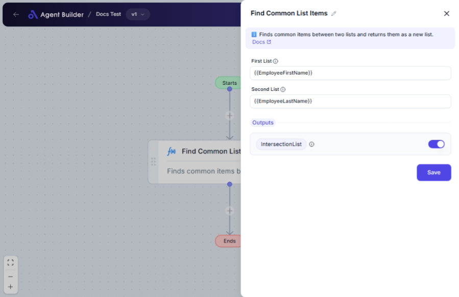

import { Callout, Steps } from "nextra/components";

# Find Common List Items

The **Find Common List Items** node helps you identify identical elements between two separate lists. This function is particularly useful when you need to filter and retrieve items that are shared across different data sets, such as finding shared customer IDs between two sales lists, or identifying common tags or labels in distinct categories.

## Configuration Options

| Field Name      | Description                 | Input Type | Required? | Default Value |
| --------------- | --------------------------- | ---------- | --------- | ------------- |
| **First List**  | The first list to compare.  | Text       | Yes       | _(empty)_     |
| **Second List** | The second list to compare. | Text       | Yes       | _(empty)_     |

## Expected Output Format

The output of this node is a **list** containing items that are common between both input lists.

- Example: If the first list is `["apple", "banana", "cherry"]` and the second list is `["banana", "kiwi", "apple"]`, the output will be `["apple", "banana"]`.

## Step-by-Step Guide

<Steps>
### Step 1

Add **Find Common List Items** node into your flow.

### Step 2

In the **First List** field, provide the first set of items you want to compare. Enter them separated by commas (e.g., `apple, banana, cherry`).

### Step 3

In the **Second List** field, provide the second set of items. Again, ensure items are separated by commas (e.g., `banana, kiwi, apple`).

### Step 4

After entering your lists, the node will automatically find and display common items in the **Intersection List** output, which can be used in the next part of your workflow.

</Steps>

<Callout type="info" title="Tip">
  Ensure that you have entered the items as a comma-separated list format for
  proper functioning of the node.
</Callout>

## Input/Output Examples

| First List            | Second List          | Intersection List    |
| --------------------- | -------------------- | -------------------- |
| `apple, banana, pear` | `banana, pear, plum` | `["banana", "pear"]` |
| `cat, dog, fish`      | `fish, bird, cat`    | `["cat", "fish"]`    |

## Common Mistakes & Troubleshooting

| Problem                        | Solution                                                                                                                                           |
| ------------------------------ | -------------------------------------------------------------------------------------------------------------------------------------------------- |
| **No items outputted**         | Ensure you have common items in both lists. If lists are different or empty, the output will be empty.                                             |
| **Entering items incorrectly** | Confirm that each item is separated by a comma and without unnecessary spaces for the node to read lists correctly.                                |
| **Unexpected Item Values**     | Make sure there is no unwanted whitespace or casing differences between the items in both lists, as this could affect recognizing common elements. |

## Real-World Use Cases

- **Customer Segmentation**: Identify common customers subscribed to multiple services.
- **Inventory Management**: Find overlapping products in different warehouse inventory lists.
- **Tag Processing**: Determine common tags used across various documents or articles.
