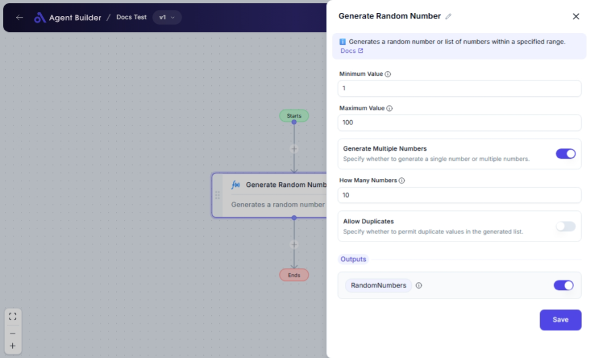

import { Callout, Steps } from "nextra/components";

# Generate Random Number

The **Generate Random Number** node enables you to create one or more random numbers within a specified range. This node is beneficial for scenarios where you need a quick set of random numbers for testing, sampling, simulations, or randomized decision-making.

For example:

- Generating a random test score between 0 and 100.
- Creating a list of random numbers for a lottery draw simulation.
- Generating random data for statistical sampling or analysis.

## Configuration Options

| Field Name                    | Description                                                                                                      | Input Type | Required? | Default Value |
| ----------------------------- | ---------------------------------------------------------------------------------------------------------------- | ---------- | --------- | ------------- |
| **Minimum Value**             | The lower boundary for the random number(s) to generate.                                                         | Text       | Yes       | _(empty)_     |
| **Maximum Value**             | The upper boundary for the random number(s) to generate.                                                         | Text       | Yes       | _(empty)_     |
| **Generate Multiple Numbers** | Specify whether to generate a single number or multiple numbers.                                                 | Switch     | No        | `false`       |
| **How Many Numbers**          | Specify how many random numbers to generate. _Appears only if generating multiple numbers._                      | Text       | No        | _(empty)_     |
| **Allow Duplicates**          | Specify whether to permit duplicate values in the generated list. _Appears only if generating multiple numbers._ | Switch     | No        | `false`       |

## Expected Output Format

- If generating a single number, you will receive a **single number value** as the output, labeled as **RandomNumber**.
- If generating multiple numbers, you will get a **list of numbers** labeled as the **RandomNumbers**.

## Step-by-Step Guide

<Steps>
### Step 1

Add the **Generate Random Number** node into your flow.

### Step 2

In the **Minimum Value** field, enter the smallest number you want to include in the random number generation.

### Step 3

In the **Maximum Value** field, enter the largest number you want to include in the random number generation.

### Step 4

Toggle **Generate Multiple Numbers** if you want more than one random number.

### Step 5

If **Generate Multiple Numbers** is enabled, specify the number of random numbers to generate in **How Many Numbers** field.

### Step 6

If generating multiple numbers, decide if duplicates are allowed by toggling **Allow Duplicates**.

### Step 7

The generated random number(s) will display as **RandomNumber** or **RandomNumbers** for further processing.

</Steps>

<Callout type="info" title="Tip">
  Ensure correct values for the **Minimum Value** and **Maximum Value** fields.
  The **Maximum Value** should always be greater than the **Minimum Value**.
</Callout>

## Input/Output Examples

| Generate Mode | Minimum Value | Maximum Value | How Many Numbers | Allow Duplicates | Example Output                  |
| ------------- | ------------- | ------------- | ---------------- | ---------------- | ------------------------------- |
| Single        | 0             | 10            | _(n/a)_          | _(n/a)_          | RandomNumber: 5                 |
| Multiple      | 1             | 5             | 3                | false            | RandomNumbers: [1, 4, 3]        |
| Multiple      | 10            | 15            | 4                | true             | RandomNumbers: [11, 13, 13, 15] |

## Common Mistakes & Troubleshooting

| Problem                           | Solution                                                                                                                                     |
| --------------------------------- | -------------------------------------------------------------------------------------------------------------------------------------------- |
| **Invalid range**                 | Make sure the **Maximum Value** is greater than the **Minimum Value**.                                                                       |
| **Field not appearing**           | Check if the **Generate Multiple Numbers** switch is enabled for relevant fields to appear.                                                  |
| **Duplicate values in list mode** | Check the **Allow Duplicates** toggle. If not allowing duplicates, the range and count should ideally allow enough unique number generation. |

## Real-World Use Cases

- **Testing scenarios**: Quickly generate random test values within a certain range for QA processes.
- **Data sampling**: Pick random data points for analysis or testing without manual selection.
- **Lottery simulation**: Create a draw of random numbers for simulating lottery or other similar number games.
