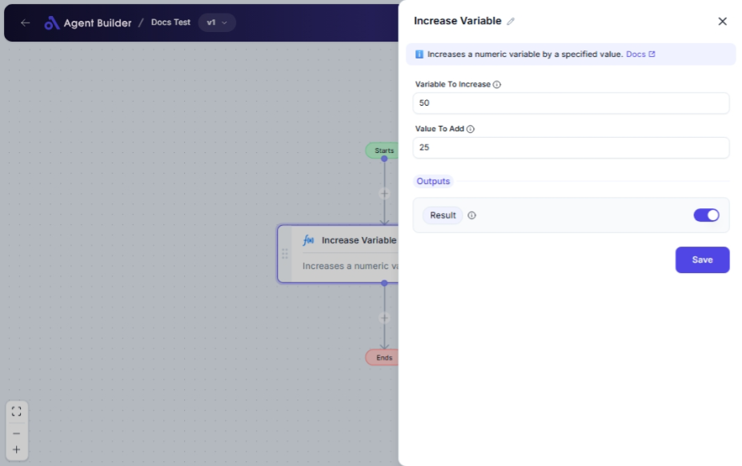

import { Callout, Steps } from "nextra/components";

# Increase Variable

The **Increase Variable** node lets you add a specified number to an existing numeric variable. This can be useful in scenarios such as incrementing counters, updating totals, or dynamically adjusting values within your workflow.

For example:

- Increasing a sales total by adding a new purchase amount.
- Incrementing a counter each time an event occurs.
- Adjusting a budget amount by adding a specified additional cost.

{/*  */}

## Configuration Options

| Field Name               | Description                                                                                 | Input Type | Required? | Default Value |
| ------------------------ | ------------------------------------------------------------------------------------------- | ---------- | --------- | ------------- |
| **Variable To Increase** | The numeric variable you want to increase.                                                  | Text       | Yes       | _(empty)_     |
| **Value To Add**         | The amount to add to the variable. Can be a number or another variable containing a number. | Text       | Yes       | _(empty)_     |

## Expected Output Format

The output of this node is a **single numeric value** representing the result after adding the specified value to the original variable.

- The increased value is made available as the **Result** output for further use.

## Step-by-Step Guide

<Steps>
### Step 1

Add the **Increase Variable** node into your flow.

### Step 2

In the **Variable To Increase** field, input the numeric variable that you wish to increase.

### Step 3

In the **Value To Add** field, specify the amount you want to add. This could be a fixed numeric value or another variable containing a numeric value.

### Step 4

After configuration, the resulting increased value will be available as **Result** for use in subsequent nodes.

</Steps>

<Callout type="warning" title="Important">
  Ensure that both **Variable To Increase** and **Value To Add** contain valid
  numeric data, otherwise, the node might not function as expected.
</Callout>

## Input/Output Examples

| Initial Variable | Value To Add | Output Value (Result) | Output Type    |
| ---------------- | ------------ | --------------------- | -------------- |
| 100              | 25           | 125                   | Number         |
| 300              | -50          | 250                   | Number         |
| 45.5             | 4.5          | 50                    | Number (Float) |

## Common Mistakes & Troubleshooting

| Problem                         | Solution                                                                                                                                            |
| ------------------------------- | --------------------------------------------------------------------------------------------------------------------------------------------------- |
| **Non-numeric value in fields** | Ensure that both input fields contain numeric values or references to variables storing numeric values. Avoid text or symbols.                      |
| **Unexpected result**           | Double-check the values in the **Variable To Increase** and **Value To Add** fields to make sure they are correct and as expected.                  |
| **No output received**          | Verify that the fields are filled and connected correctly in the workflow. Also, make sure the node is active and integrated properly in your flow. |

## Real-World Use Cases

- **Inventory Management**: Automatically add incoming stock quantities to existing inventory levels.
- **Sales Tracking**: Increase sales totals dynamically when new orders are processed.
- **Usage Monitoring**: Increment a counter each time a user engages with a feature.
- **Cost Calculations**: Update budgeting figures automatically when new expenses are logged.
