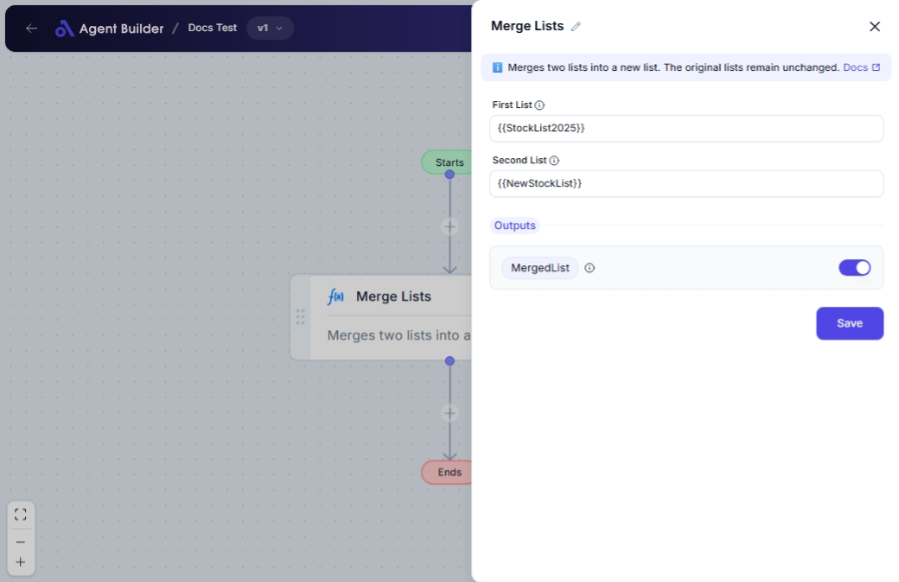

import { Callout, Steps } from "nextra/components";

# Merge Lists

The **Merge Lists** node lets you create a new list by combining two separate lists of items into one. This is particularly useful when you need to consolidate data from different sources into a single list for easier management and analysis.

For example:

- Merging customer names from two separate datasets into one comprehensive list.
- Combining product lists from different suppliers.

## Configuration Options

| Field Name      | Description                        | Input Type | Required? | Default Value |
| --------------- | ---------------------------------- | ---------- | --------- | ------------- |
| **First List**  | The first list of items to merge.  | Text       | Yes       | _(empty)_     |
| **Second List** | The second list of items to merge. | Text       | Yes       | _(empty)_     |

## Expected Output Format

The output of this node is a **single list value** that contains all items from both input lists, preserving the order as they were input.

## Step-by-Step Guide

<Steps>
### Step 1

Add the **Merge Lists** node into your flow.

### Step 2

In the **First List** field, enter the first list of items you want to merge. Separate items by commas or new lines as needed.

### Step 3

In the **Second List** field, enter the second list of items to combine with the first list.

### Step 4

The combined result will be accessible as **MergedList**, ready for use in subsequent nodes.

</Steps>

<Callout type="info" title="Note">
  Ensure each list is properly formatted. A list should be a series of items
  separated by commas or new lines.
</Callout>

## Input/Output Examples

| First List      | Second List     | Output Value                   | Output Type |
| --------------- | --------------- | ------------------------------ | ----------- |
| `apple, banana` | `orange, grape` | `apple, banana, orange, grape` | List        |
| `John\nAlice`   | `Bob`           | `John, Alice, Bob`             | List        |

## Common Mistakes & Troubleshooting

| Problem                   | Solution                                                                             |
| ------------------------- | ------------------------------------------------------------------------------------ |
| **Lists not merging**     | Check that you entered both lists in the text fields. Ensure each list is non-empty. |
| **Incorrect list format** | Double-check that items are separated correctly by commas or new lines.              |

## Real-World Use Cases

- **Data Consolidation**: Combine lists of email contacts from different campaigns to create a master contact list.
- **Inventory Management**: Merge product lists from different suppliers to update inventory in a single step.
- **Project Management**: Consolidate task lists from multiple teams for unified project tracking.
