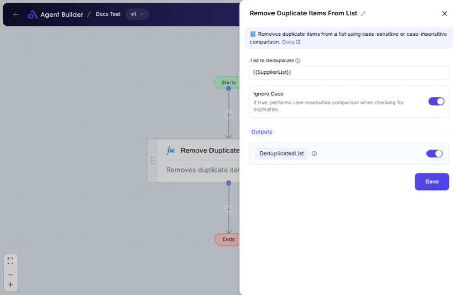

import { Callout, Steps } from "nextra/components";

# Remove Duplicate Items From List

The **Remove Duplicate Items From List** node helps you clean up a list by removing any duplicate items it contains. This can be particularly useful for data preparation, ensuring that lists used in further processing or reporting contain only unique entries.

Some practical applications include:

- Cleaning up email lists to prevent duplicate emails being sent.
- Ensuring unique identifiers when processing user data.
- Simplifying reports by removing redundant entries.

## Configuration Options

| Field Name              | Description                                                                 | Input Type | Required? | Default Value |
| ----------------------- | --------------------------------------------------------------------------- | ---------- | --------- | ------------- |
| **List to Deduplicate** | The list variable to remove duplicate values from.                          | Text       | Yes       | _(empty)_     |
| **Ignore Case**         | If true, performs case-insensitive comparison when checking for duplicates. | Switch     | No        | false         |

## Expected Output Format

The output of this node is a **list of unique values**. If duplicates are removed:

- The list will only contain each item once, in the order they first appeared.
- Case sensitivity is optional, based on the configuration (e.g., "apple" and "Apple" can be treated as duplicate or unique).

## Step-by-Step Guide

<Steps>
  ### Step 1

Add the **Remove Duplicate Items From List** node into your flow.

### Step 2

In the **List to Deduplicate** field, enter the list from which you wish to remove duplicates. This should be a variable or list expression.

### Step 3

Toggle the **Ignore Case** switch based on whether you want the comparison to be case-sensitive or case-insensitive. Default is case-sensitive (switch off).

### Step 4

The deduplicated list will be available as **DeduplicatedList** for use in other nodes or processes.

</Steps>

<Callout type="info" title="Tip">
  Enabling **Ignore Case** will treat items like "Apple" and "apple" as
  duplicates, removing one occurrence if found.
</Callout>

## Input/Output Examples

| List to Deduplicate            | Ignore Case | Output List                    | Output Type     |
| ------------------------------ | ----------- | ------------------------------ | --------------- |
| `["apple", "banana", "apple"]` | false       | `["apple", "banana"]`          | List of Strings |
| `["Apple", "banana", "apple"]` | true        | `["Apple", "banana"]`          | List of Strings |
| `["apple", "Apple", "banana"]` | false       | `["apple", "Apple", "banana"]` | List of Strings |

## Common Mistakes & Troubleshooting

| Problem                                   | Solution                                                                                                       |
| ----------------------------------------- | -------------------------------------------------------------------------------------------------------------- |
| **Non-list input in List to Deduplicate** | Ensure the input is a valid list. Check that the variable or expression resolves to a list format.             |
| **Case-sensitive duplicates remain**      | If you find that items differing only by case remain, consider enabling the **Ignore Case** option.            |
| **Unexpected list alteration**            | Verify that your input list is correctly specified and that no preprocessing steps have altered it beforehand. |

## Real-World Use Cases

- **Contact Management**: Remove duplicate entries from a contact list to ensure messages and emails are sent correctly.
- **Product Catalogs**: Ensure product listings do not contain duplicate entries, thus simplifying pricing and inventory management.
- **Data Cleaning**: Prepare datasets by stripping out redundant data, making subsequent analysis or machine learning tasks more efficient.
