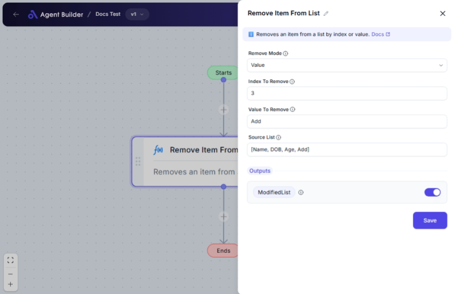

import { Callout, Steps } from "nextra/components";

# Remove Item From List

The **Remove Item From List** node allows you to modify lists by removing specific items, either by their position within the list or by their exact value. This is useful when you need to clean or adjust data sets for further processing or reporting.

For example:

- Removing an item by specifying its position (index) within the list.
- Getting rid of all occurrences of a specific value from a list.

{/*  */}

## Configuration Options

| Field Name          | Description                                                | Input Type | Required? | Default Value |
| ------------------- | ---------------------------------------------------------- | ---------- | --------- | ------------- |
| **Remove Mode**     | Choose whether to remove an item by its index or by value. | Select     | Yes       | _(empty)_     |
| **Index To Remove** | The zero-based index of the item you want to remove.       | Text       | No        | _(empty)_     |
| **Value To Remove** | The value of the item you want to remove from the list.    | Text       | Yes       | _(empty)_     |
| **Source List**     | The list from which you want to remove an item.            | Text       | Yes       | _(empty)_     |

## Expected Output Format

The output of this node is a **list** containing the updated items after removal. The format remains the same as the input list, but without the specified item(s).

## Step-by-Step Guide

<Steps>
### Step 1

Add **Remove Item From List** node into your flow.

### Step 2

In the **Source List** field, enter the list from which you want to remove an item. Ensure the list is properly formatted and separated.

### Step 3

In the **Remove Mode** dropdown, select whether you want to remove by **Index** or **Value**.

- **Index**: Removes an item based on its position. Use this mode when you know the exact position.
- **Value**: Removes item(s) that match a specific value. Use this mode for value-specific removal.

### Step 4

- If you selected **Index**: Enter the zero-based index in the **Index To Remove** field.
- If you selected **Value**: Enter the value you want to remove in the **Value To Remove** field.

### Step 5

Once configured, the output can be accessed as **ModifiedList**, representing the updated list.

</Steps>

<Callout type="info" title="Tip">
  If you select “Index” in the **Remove Mode** dropdown, only the “Index To
  Remove” field is necessary; the “Value To Remove” field can be left empty.
</Callout>

## Input/Output Examples

| Remove Mode | Source List                   | Index To Remove | Value To Remove | Output Value        |
| ----------- | ----------------------------- | --------------- | --------------- | ------------------- |
| Index       | ["apple", "banana", "cherry"] | 1               | _(n/a)_         | ["apple", "cherry"] |
| Value       | ["apple", "banana", "banana"] | _(n/a)_         | "banana"        | ["apple"]           |

## Common Mistakes & Troubleshooting

| Problem               | Solution                                                                                                 |
| --------------------- | -------------------------------------------------------------------------------------------------------- |
| **No item removed**   | Ensure the correct mode (Index or Value) is selected and that it matches the input for accurate removal. |
| **Index error**       | Check that "Index To Remove" is a valid number and within the bounds of the list.                        |
| **Value not removed** | Ensure the "Value To Remove" exists in the list and is correctly spelled or formatted.                   |

## Real-World Use Cases

- **Data Cleaning**: Automatically remove duplicates by value from a list of user inputs or selections.
- **Shopping Carts**: Remove items from a user's shopping cart based on their selection.
- **List Management**: Easily modify lists by removing unneeded entries, such as deleting obsolete tasks or outdated records.
