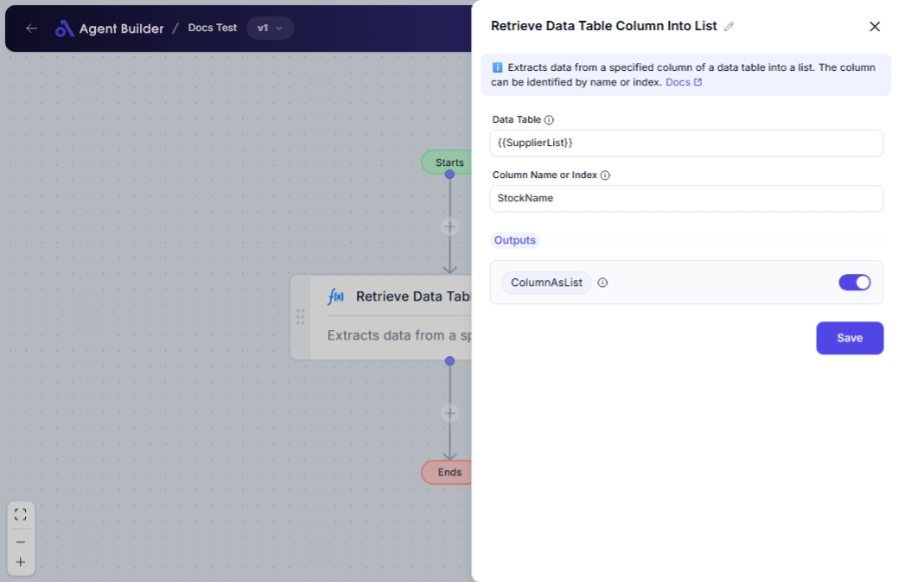

import { Callout, Steps } from "nextra/components";

# Retrieve Data Table Column Into List

The **Retrieve Data Table Column Into List** node is designed to extract a single column from a given data table and convert its contents into a list format. This is particularly useful when you need to work with a specific column's data independently for further analysis or processing in your workflow.

For example:

- Extracting a list of email addresses stored in a "Contacts" data table.
- Creating a list of product names from a "Products" data table for inventory operations.

## Configuration Options

| Field Name               | Description                                                                   | Input Type | Required? | Default Value |
| ------------------------ | ----------------------------------------------------------------------------- | ---------- | --------- | ------------- |
| **Data Table**           | The data table containing the column to convert into a list.                  | Text       | Yes       | _(empty)_     |
| **Column Name or Index** | Specifies which column to extract by name (if defined) or index (zero-based). | Text       | Yes       | _(empty)_     |

## Expected Output Format

The output of this node is a **list of strings**, each representing the contents of the specified column in the data table.

## Step-by-Step Guide

<Steps>

### Step 1

Add **Retrieve Data Table Column Into List** node into your flow.

### Step 2

In the **Data Table** field, enter the data table from which you want to extract a column.

### Step 3

In the **Column Name or Index** field, specify the column you want to convert to a list. You can do this by entering the column's name (if available) or its zero-based index (e.g., 0 for the first column).

### Step 4

The contents of the selected column will be converted into a list and made available as **ColumnAsList** for use in subsequent nodes.

</Steps>

<Callout type="tip" title="Tip">
  Make sure that the column specified exists within the data table to prevent
  errors.
</Callout>

## Input/Output Examples

| Data Table | Column Name or Index | Output Value                               | Output Type     |
| ---------- | -------------------- | ------------------------------------------ | --------------- |
| Users      | Email                | ["user1@example.com", "user2@example.com"] | List of Strings |
| Products   | 2                    | ["Product A", "Product B"]                 | List of Strings |

## Common Mistakes & Troubleshooting

| Problem                           | Solution                                                                          |
| --------------------------------- | --------------------------------------------------------------------------------- |
| **Column not found or incorrect** | Ensure the Column Name or Index accurately matches the data table structure.      |
| **Data Table field is empty**     | Enter the name of the data table you are extracting from.                         |
| **Non-existent index provided**   | Verify that the index is within the range of available columns in the data table. |

## Real-World Use Cases

- **Email Marketing**: Extract an email column from a user database to create a mailing list.
- **Inventory Management**: Convert a product name column into a list to automate stock checking.
- **Customer Segmentation**: Retrieve user data columns for targeted analysis and campaign creation.
