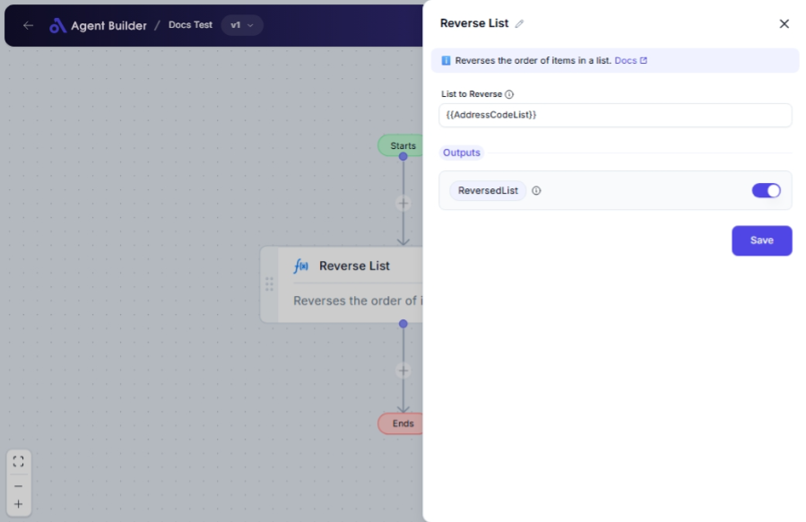

import { Callout, Steps } from "nextra/components";

# Reverse List

The **Reverse List** node is designed to rearrange the order of elements in a list, flipping it so that the last item becomes the first and vice versa. This feature is particularly useful when you want to change the perspective or sorting of your data set for analysis or presentation purposes. For example, reversing a list of recent transactions to display the most recent entries first.

## Configuration Options

| Field Name          | Description                                 | Input Type | Required? | Default Value |
| ------------------- | ------------------------------------------- | ---------- | --------- | ------------- |
| **List to Reverse** | The list whose item order will be reversed. | Text       | Yes       | _(empty)_     |

## Expected Output Format

The output of this node is a **list** where items are arranged in the reverse order of the input list.

- If the original list is `[A, B, C]`, the output will be `[C, B, A]`.

## Step-by-Step Guide

<Steps>
### Step 1

Add the **Reverse List** node to your flow.

### Step 2

In the **List to Reverse** field, input the list of items you want to have reordered. Ensure that your input format is correct, usually as a comma-separated text string or in a format that your particular system uses for lists.

### Step 3

Once the list is inputted correctly, the node will reverse the order of the items.

### Step 4

The output is accessible as **ReversedList**. You can connect this output to further nodes for additional processing or display.

</Steps>

<Callout type="info" title="Tip">
  Ensure your input is formatted correctly; improperly formatted input will not
  process as expected.
</Callout>

## Input/Output Examples

| Input List                      | Output List                     | Output Type |
| ------------------------------- | ------------------------------- | ----------- |
| `[1, 2, 3, 4, 5]`               | `[5, 4, 3, 2, 1]`               | List        |
| `['apple', 'banana', 'cherry']` | `['cherry', 'banana', 'apple']` | List        |

## Common Mistakes & Troubleshooting

| Problem                        | Solution                                                                                        |
| ------------------------------ | ----------------------------------------------------------------------------------------------- |
| **Input list is not reversed** | Ensure that each item in your list is properly separated and that the list format is valid.     |
| **Incorrect input format**     | Check that your input follows the expected format (e.g., comma-separated values if applicable). |

## Real-World Use Cases

- **Order Processing**: Reverse an order list to deal with the latest orders first.
- **Transaction Logs**: Reverse transaction records to show the most recent activities at the top.
- **Playlist Management**: Reverse the order of songs in a playlist for a new listening experience.
