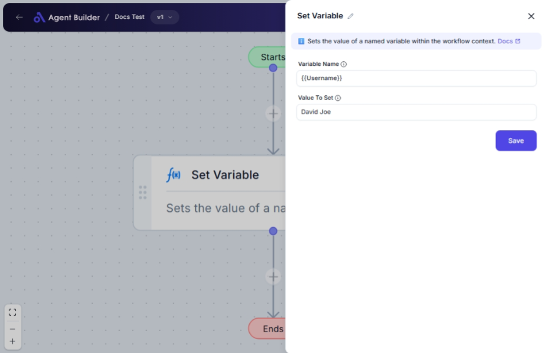

import { Callout, Steps } from "nextra/components";

# Set Variable

The **Set Variable** node is designed to store data by assigning a value to a specified variable name within your automation workflow. This feature is particularly helpful if you need to reuse information later in your process or share it between different parts of your workflow.

For example:

- Storing interim calculation results to use in subsequent steps.
- Temporarily saving user input for further validation or transformation.
- Keeping frequently accessed data accessible for multiple operations, reducing the need for repetitive input.

{/*  */}

## Configuration Options

| Field Name        | Description                                                               | Input Type | Required? | Default Value |
| ----------------- | ------------------------------------------------------------------------- | ---------- | --------- | ------------- |
| **Variable Name** | The name of the variable to set. Input should be descriptive but concise. | Text       | Yes       | _(empty)_     |
| **Value To Set**  | The value (text, number, list, or object) to assign to the variable.      | Text       | Yes       | _(empty)_     |

## Expected Output Format

The output of this node is the **value that has been set**. The format of the output depends on the input value type; it can be text, a number, a list, or an object.

## Step-by-Step Guide

<Steps>
### Step 1

Add the **Set Variable** node into your flow.

### Step 2

In the **Variable Name** field, enter the name of the variable you want to create or update.

### Step 3

In the **Value To Set** field, input the value you want to store in the variable. Ensure it matches the intended data type (e.g., text, number).

### Step 4

Confirm the setup by ensuring all required fields are filled appropriately. The variable will now hold the defined value for use in your automation workflow.

</Steps>

<Callout type="info" title="Tip">
  Use distinct and descriptive names for your variables to avoid conflicts and
  improve workflow clarity.
</Callout>

## Input/Output Examples

| Variable Name | Value To Set        | Output              | Output Type    |
| ------------- | ------------------- | ------------------- | -------------- |
| User Age      | 25                  | 25                  | Number         |
| User Name     | "John Smith"        | John Smith          | Text           |
| Price List    | [19.99, 24.99]      | [19.99,24.99]       | List of Number |
| User Details  | {"{"}"name":"John"} | {"{"}"name":"John"} | Object         |

## Common Mistakes & Troubleshooting

| Problem                                                 | Solution                                                                                                           |
| ------------------------------------------------------- | ------------------------------------------------------------------------------------------------------------------ |
| **Empty Variable Name or Value To Set**                 | Ensure both the **Variable Name** and **Value To Set** fields are filled out, as they are required for operation.  |
| **Incorrect variable names leading to data collisions** | Use unique and descriptive variable names for better management and to prevent overwriting existing variables.     |
| **Data type mismatch**                                  | Confirm that the data type of the value matches your intended use and is valid for subsequent workflow operations. |

## Real-World Use Cases

- **User Authentication**: Storing the session token after login for validation with future requests.
- **E-commerce**: Keeping track of items in a user's shopping cart throughout a session.
- **Data Aggregation**: Compiling collected data over time to perform cumulative analysis or reporting.
