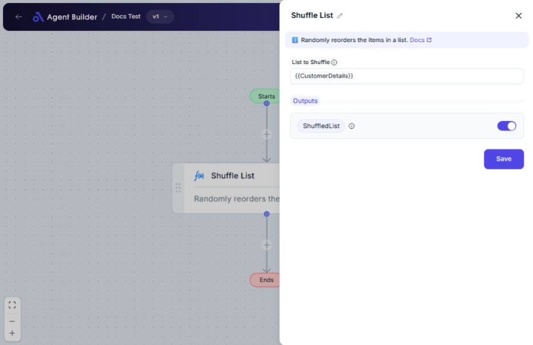

import { Callout, Steps } from "nextra/components";

# Shuffle List

The **Shuffle List** node is used to randomly reorder the items in a list. This is useful when you need to randomize the order of elements, such as generating random orders of tasks, creating random samples, or ensuring variety in output.

For example:

- Randomizing questions in a quiz to ensure different order each time.
- Shuffling a deck of cards to simulate a card game.

## Configuration Options

| Field Name          | Description                            | Input Type | Required? | Default Value |
| ------------------- | -------------------------------------- | ---------- | --------- | ------------- |
| **List to Shuffle** | The list you want to randomly reorder. | Text       | Yes       | _(empty)_     |

## Expected Output Format

The output of this node is a **list of items** that has been randomly reordered.

- Input a list in text format (e.g., `["apple", "banana", "cherry"]`).
- Output will be a list with the same items in a new, randomized order.

## Step-by-Step Guide

<Steps>
### Step 1

Add **Shuffle List** node into your flow.

### Step 2

In the **List to Shuffle** field, enter the list you want to shuffle. Ensure the list items are enclosed within square brackets and separated by commas.

### Step 3

Once the list is provided, the node will output a new list available as **ShuffledList** that can be used in your workflow.

</Steps>

<Callout type="info" title="Tip">
  Make sure your list is formatted properly with commas and brackets, e.g.,
  ["item1", "item2", "item3"].
</Callout>

## Input/Output Examples

| Input List                           | Output Value                         | Output Format   |
| ------------------------------------ | ------------------------------------ | --------------- |
| ["apple", "banana", "cherry"]        | ["banana", "cherry", "apple"]        | List of Strings |
| ["task1", "task2", "task3", "task4"] | ["task3", "task1", "task4", "task2"] | List of Strings |

## Common Mistakes & Troubleshooting

| Problem                              | Solution                                                                                                  |
| ------------------------------------ | --------------------------------------------------------------------------------------------------------- |
| **Input list is not being accepted** | Ensure that the input is formatted correctly as a list of strings (items in quotes, separated by commas). |
| **No shuffle appears to occur**      | Verify that each list entry is unique. Identical entries may appear unchanged in position.                |

## Real-World Use Cases

- **Education**: Randomize question orders in exams to minimize sharing answers.
- **Gaming**: Shuffle a deck of cards or game pieces for fair gameplay.

