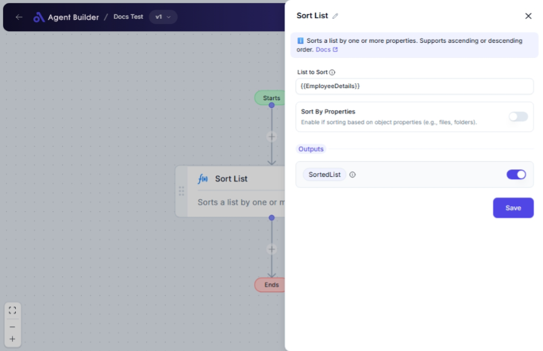

import { Callout, Steps } from "nextra/components";

# Sort List

The **Sort List** node allows you to organize items in a list according to your specified criteria. This is particularly useful for arranging data in a desired order, such as alphabetical or numerical, or sorting objects by their properties.

You can use this node to:

- Arrange file names or numbers in ascending or descending order.
- Sort a list of objects based on specific attributes like size, date, or name.

{/*  */}

## Configuration Options

| Field Name                     | Description                                                                                      | Input Type | Required? | Default Value |
| ------------------------------ | ------------------------------------------------------------------------------------------------ | ---------- | --------- | ------------- |
| **List to Sort**               | The variable that contains the list you want to sort.                                            | Text       | Yes       | _(empty)_     |
| **Sort By Properties**         | Enable this feature if you are sorting items that have properties (e.g., sorting files by name). | Switch     | No        | False         |
| **First Property to Sort By**  | The primary attribute to sort the items by, if sorting by properties is enabled.                 | Text       | No        | _(empty)_     |
| **First Sort Direction**       | Choose whether to sort the first attribute in ascending or descending order.                     | Select     | No        | Ascending     |
| **Second Property to Sort By** | Specify a secondary attribute to refine sorting, if applicable.                                  | Text       | No        | _(empty)_     |
| **Second Sort Direction**      | Select how to order the second attribute: ascending or descending.                               | Select     | No        | Ascending     |
| **Third Property to Sort By**  | An additional attribute for further sorting precision, if needed.                                | Text       | No        | _(empty)_     |
| **Third Sort Direction**       | Decide the order for the third attribute: ascending or descending.                               | Select     | No        | Ascending     |

## Expected Output Format

The node outputs a **sorted list** based on the input criteria. The sorted list can be used for further processing in other nodes.

## Step-by-Step Guide

<Steps>
### Step 1

Add the **Sort List** node to your flow.

### Step 2

Enter your data into the **List to Sort** field. This is the list you intend to organize.

### Step 3

(Optional) If sorting items that have multiple attributes, switch on **Sort By Properties**.

### Step 4

(Optional) If **Sort By Properties** is enabled, enter the first property name in **First Property to Sort By** and choose the order using **First Sort Direction**.

### Step 5

(Optional) To refine the sorting, set additional attributes in **Second Property to Sort By** and **Third Property to Sort By**, along with their respective sorting directions.

### Step 6

View the sorted output as **SortedList** and use it in your process chain as needed.

</Steps>

<Callout type="info" title="Tip">
  Use the **Sort By Properties** feature for sorting lists of objects or complex
  data structures to achieve more meaningful ordering.
</Callout>

## Input/Output Examples

| List to Sort                                            | Sort By Properties | Properties & Directions   | Output Value                  | Output Type |
| ------------------------------------------------------- | ------------------ | ------------------------- | ----------------------------- | ----------- |
| `["banana", "apple", "pear"]`                           | No                 | _(n/a)_                   | `["apple", "banana", "pear"]` | SortedList  |
| `[{"name": "A", "size": 10}]`                           | Yes                | First: "name", Ascending  | Sorted list by name           | SortedList  |
| `[{"name": "A", "size": 10}, {"name": "B", "size": 5}]` | Yes                | First: "size", Descending | Sorted list by size           | SortedList  |

## Common Mistakes & Troubleshooting

| Problem                            | Solution                                                                                   |
| ---------------------------------- | ------------------------------------------------------------------------------------------ |
| **List does not sort as expected** | Ensure that the list variable is correct and contains sortable data.                       |
| **Properties sorting not working** | Check if **Sort By Properties** is enabled and property names are accurate.                |
| **Unexpected output format**       | The output is in its original list format, but ordered. Double-check criteria for sorting. |

## Real-World Use Cases

- **Product Listings**: Sort a list of products by price, name, or date added.
- **File Management**: Order files by name or last modified date for better management.
- **Data Cleaning**: Rearrange records in datasets into a meaningful order for analysis.
