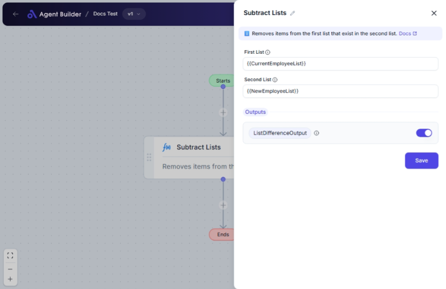

import { Callout, Steps } from "nextra/components";

# Subtract Lists

The **Subtract Lists** node allows you to create a new list by subtracting elements of one list from another. This node is useful when you want to determine the difference between two sets of data, such as removing certain elements from an inventory or aggregating data without specific entries.

For example:

- Removing products from a master list that have been sold.
- Finding unique customers who haven't bought a particular product from your lists.

## Configuration Options

| Field Name      | Description                                                     | Input Type | Required? | Default Value |
| --------------- | --------------------------------------------------------------- | ---------- | --------- | ------------- |
| **First List**  | The list you want to modify by removing certain items.          | Text       | Yes       | _(empty)_     |
| **Second List** | The list containing items to be subtracted from the first list. | Text       | Yes       | _(empty)_     |

## Expected Output Format

The output of this node is a **list** that contains elements present in the first list but not in the second list.

- The output will be an array-like data structure containing the non-subtracted elements (e.g., `['element1', 'element3']`).

## Step-by-Step Guide

<Steps>
### Step 1

Add **Subtract Lists** node into your flow.

### Step 2

In the **First List** field, enter the list of items you want to compare.

### Step 3

In the **Second List** field, input the list of items you wish to subtract from the first list.

### Step 4

The processed list will be available as **List Difference Output** for use in downstream nodes.

</Steps>

<Callout type="info" title="Note">
  Make sure that both lists are in compatible formats. For example, both should
  be formatted as a comma-separated string if inputting manually.
</Callout>

## Input/Output Examples

| First List          | Second List          | Output Value | Output Type   |
| ------------------- | -------------------- | ------------ | ------------- |
| ['item1', 'item2']  | ['item2']            | ['item1']    | List (String) |
| ['apple', 'banana'] | ['banana', 'orange'] | ['apple', 'orange']    | List (String) |

## Common Mistakes & Troubleshooting

| Problem                                        | Solution                                                                                       |
| ---------------------------------------------- | ---------------------------------------------------------------------------------------------- |
| **Entering a single string instead of a list** | Input should be list formatted, such as `['item1', 'item2']`. Ensure square brackets are used. |
| **No output generated**                        | Ensure that both lists are entered correctly and there are elements to subtract.               |
| **Unexpected differences in lists**            | Double-check the list formats and ensure they match the expected input structure.              |

## Real-World Use Cases

- **Inventory Management**: Remove sold items from stock lists for shipment processing.
- **Data Analysis**: Filter out known values from survey responses to focus on unique feedback.
- **Customer Lists**: Identify customers who haven't purchased specific products for targeted marketing.
