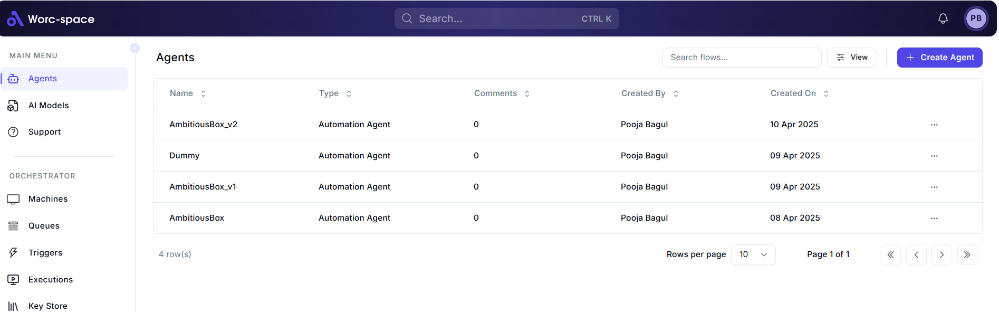

# Agent

## Description
This image shows a user interface of a software application named "Worcspace," focusing on the "Main Menu" and the "Agents" tab. Below is a detailed breakdown of these specific sections:

## Main Menu
- **Location**: The Main Menu is located on the left side of the interface in a vertical sidebar.
- **Title**: 
  - The title "MAIN MENU" is displayed at the top of the sidebar in uppercase letters with a light gray font.
- **Menu Items**:
  - **Agents**:
    - Highlighted as the active tab with a blue background and white text.
    - Preceded by a small icon resembling a person or agent.
  - **AI Models**:
    - Displayed below "Agents" with a gray font, indicating it is not active.
    - Preceded by a small icon resembling a neural network or model.
  - **Support**:
    - Displayed below "AI Models" with a gray font.
    - Preceded by a small question mark icon inside a circle.

## Agents Tab
- **Location**: The Agents tab is the main content area to the right of the Main Menu sidebar.
- **Title**: 
  - The title "Agents" is displayed at the top of the tab in a bold, dark font.
- **Search Bar**:
  - A search bar is located just below the title with a placeholder text "Search flows..." and a magnifying glass icon on the left.
- **View Options**:
  - To the right of the search bar, there is a "View" button with a grid icon, suggesting options to change the view layout (e.g., list or grid).
- **Create Agent Button**:
  - To the right of the "View" button, there is a purple button labeled "CREATE AGENT" with a plus (+) icon, allowing the user to create a new agent.
- **Table**:
  - The main content of the Agents tab is a table displaying a list of agents with the following columns:
    - **Name**:
      - Lists the names of the agents: "AmbitiousBOX-v2," "Dummy," "AmbitiousBOX-v1," and "AmbitiousBOX."
    - **Type**:
      - All agents are listed as "Automation Agent."
    - **Comments**:
      - All agents have "0" comments.
    - **Created By**:
      - All agents were created by "Pooja Bagul."
    - **Created On**:
      - Dates of creation are "10 Apr 2025," "09 Apr 2025," "09 Apr 2025," and "08 Apr 2025" respectively.
    - **Actions**:
      - Each row has an ellipsis (...) button, likely for additional actions like editing or deleting the agent.
- **Table Footer**:
  - Below the table, there is a footer showing "4 row(s)" on the left.
  - On the right, there are pagination controls:
    - A dropdown set to "Rows per page: 10."
    - A label "Page 1 of 1," indicating there is only one page.
    - Navigation arrows (left and right), which are grayed out, indicating no additional pages to navigate.
