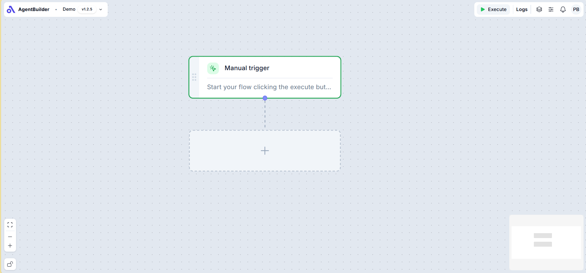

# Overview

The Agent Builder provides a visual Canvas where you can drag and drop to build sequences of business logic and actions using pre-built configuration panels. With just a few clicks, you can design powerful agents that automate tasks, make decisions, and interact with systems. Once built, you can publish and run these agents based on custom triggers — such as events, schedules, or API calls.

It’s automation made simple, visual, and scalable.

## What are Agents?
Agents are autonomous or semi-autonomous software scripts that can perform tasks, make decisions, and interact with systems or users based on rules, triggers, or learned behavior. In simple words, an agent is a self-contained unit that listens, thinks, and acts — often in response to a trigger or condition.
In Worc, an agent is a modular, logic-driven automation built visually using the Agent Builder. It can be triggered by events (like form submissions, file uploads, API calls), and it executes a sequence of logic blocks — including conditions, actions, API calls, AI functions, and more.

## Key Components of a Agent Builder
Understanding the components of a Agent Builder will give you a clearer picture of how to create, run, and refine your agents:

+ **Canvas**: This is your primary workspace, where you'll piece together the different blocks of your Agent.
+ **Triggers**: This defines when your workflow starts and what data will be passed into it. It could be an event, like a new record being created, or maybe a specific date and time or any other custom trigger you define.
+ **Nodes**: Think of these as individual actions or steps in your Agent. They can range from sending emails, updating attributes, to even more complex operations.
+ **Configuration Panels**: A Configuration Panel is a user interface element that lets you customize the behavior, inputs, and settings of a Node within a workflow — without writing code.
+ **Paths**: These are the connectors between Nodes, dictating the flow and sequence of actions within your Agent.
+ **Inputs**: Information or data that is required for a Node to run.
+ **Runs**: Each execution of a Agent is called a 'run'. This can help you track actions performed by the Agent.
+ **Templates**: Pre-built flows that you can utilize as starting points or inspiration.

## Building a Agent
To build a Agent you can either start from scratch or use a template. Here's a step-by-step guide:

+ **Choose your starting point**:
  + Begin with a blank canvas for full customization.
  + Or, use one of the available templates to get a head start.
+ **Choose a trigger**: Determine when your Agent should kick off and what data get passed to each run.
+ **Add Nodes**: Hover over your trigger and click the + icon to add the next Node to your canvas.
+ **Set inputs**: In the configuration panels, define the data each Node needs to execute correctly.
+ **Deleting Nodes**: Simply select the unwanted Node and hit backspace or click delete.
+ **Reordering Nodes**: Select the paths you’d like to remove and hit backspace. Click and drag the blue connecting node to another activity to create a new path.
+ **Publishing**: Click Publish to take your Agent out of the Build stage and allow it to be run when the trigger condition is met.

## Running a Agent
There are two ways to run a Agent:
1. **Automatically**: Set up conditions that when met cause the Agent to run automatically, without any manual intervention. Often this is on the creation or update of a piece of data.
2. **Manually**: Choose this when you need to execute a Agent on-demand. The Execute trigger on the top-left side on the screen will let you do this.

**Congratulations!**

You’re now equipped with the foundational knowledge to harness the power of Agents in Worc.

As you continue to explore, experiment, and build, remember:

	The more you engage with the platform, the deeper your understanding will grow — unlocking new ways to automate, innovate, and create cutting-edge solutions.

So go ahead — start building, stay curious, and make the most of what Worc has to offer.

Happy Building! 