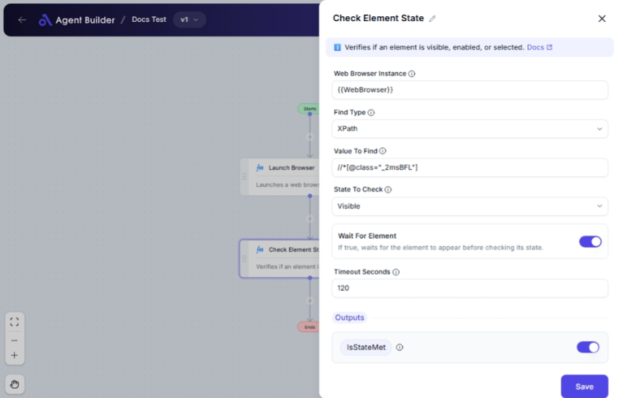

import { Callout, Steps } from "nextra/components";

# Check Element State

The **Check Element State** node is used to verify the state of an element on a web page, ensuring it meets specific conditions such as being visible, enabled, or selected. This functionality is particularly useful in web automation processes for validating that elements are in a suitable state for interactions like clicking or entering data.

For example:

- Checking if a "Submit" button is visible and enabled before attempting to click it.
- Verifying if a checkbox is selected before proceeding with form submissions.
- Ensuring that elements load and are visible within a specified timeout period.

 

## Configuration Options

| Field Name               | Description                                                                       | Input Type | Required? | Default Value |
| ------------------------ | --------------------------------------------------------------------------------- | ---------- | --------- | ------------- |
| **Web Browser Instance** | Enter or choose the variable that contains the web browser instance to work with. | Text       | Yes       | _(empty)_     |
| **Find Type**            | Specifies how to find the element (e.g., ID, XPath, CssSelector).                 | Select     | Yes       | XPath         |
| **Value To Find**        | The value used to locate the element (e.g., `username`, `//input[@id='email']`).  | Text       | Yes       | _(empty)_     |
| **State To Check**       | Specifies which state to verify: Visible, Enabled, Selected.                      | Select     | Yes       | Visible       |
| **Wait For Element**     | If true, waits for the element to appear before checking its state.               | Switch     | No        | _(empty)_     |
| **Timeout Seconds**      | Maximum time in seconds to wait for the element before failing.                   | Text       | No        | 60            |

## Expected Output Format

The output of this node is a **boolean value** representing whether the element's state meets the specified condition.

- `true` if the element state (Visible, Enabled, or Selected) is met.
- `false` otherwise.

## Step-by-Step Guide

<Steps>
### Step 1

Add **Check Element State** node into your flow.

### Step 2

In the **Web Browser Instance** field, enter or choose the variable containing your web browser instance.

### Step 3

In the **Find Type** dropdown, select the method to locate the element, such as XPath or ID.

### Step 4

In the **Value To Find** field, enter the value that identifies the element (e.g., an ID or XPath expression).

### Step 5

Choose the **State To Check** to determine whether the element is visible, enabled, or selected.

### Step 6

(Optional) Toggle **Wait For Element** if you want to delay the check until the element appears.

### Step 7

(Optional) Set **Timeout Seconds** to specify how long to wait for the element to appear before the check fails.

</Steps>

<Callout type="info" title="Tip">
  Use the “Wait For Element” option to ensure dynamic content is ready before
  checking the state.
</Callout>

## Input/Output Examples

| Find Type   | Value To Find            | State To Check | Wait For Element | Timeout Seconds | Output Value | Output Type |
| ----------- | ------------------------ | -------------- | ---------------- | --------------- | ------------ | ----------- |
| XPath       | `//button[@id='submit']` | Visible        | Yes              | 30              | true         | Boolean     |
| Id          | `username`               | Enabled        | No               | _(n/a)_         | false        | Boolean     |
| CssSelector | `#select-checkbox`       | Selected       | Yes              | 60              | true         | Boolean     |

## Common Mistakes & Troubleshooting

| Problem                            | Solution                                                                                                  |
| ---------------------------------- | --------------------------------------------------------------------------------------------------------- |
| **Element not found error**        | Check if the **Find Type** and **Value To Find** match an existing element on the page.                   |
| **Timeout but element is present** | Increase the **Timeout Seconds** if elements take longer to load. Verify the **Wait For Element** option. |
| **State not met as expected**      | Re-evaluate the **State To Check** setting, and ensure element properties meet the desired condition.     |

## Real-World Use Cases

- **Form Submission**: Verifying submit buttons are enabled and visible to ensure effective form submissions.
- **Checkbox and Radio Validation**: Checking if selections have been made before proceeding with related actions.
- **Dynamic Content Loading**: Waiting for dynamically loaded content, like modal dialogs, before performing operations.
