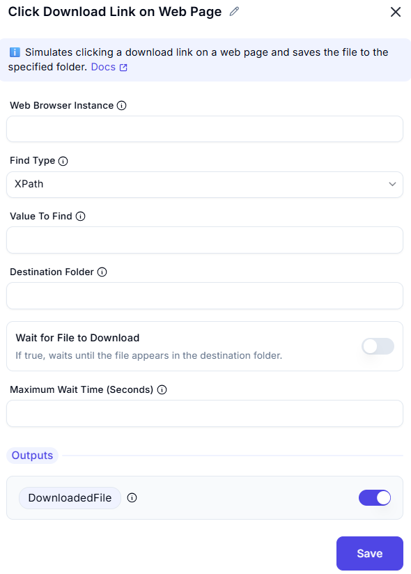

# Click Download Link on Web Page  

## Description
This action automates clicking on a download link in a web browser and saving the file to a specified folder.  
It is useful for automating file downloads from web pages.  

  

## Fields and Options 

### 1. **Web Browser Instance**
- Select the active browser instance where the download action should take place.  
- Ensures the action occurs in the correct browsing session.  

### 2. **Find Type**
- Specify which type of selecxtors you are passing  
- The element can be identified using selectors like XPath, CSS, or attributes.  

### 2. **Value To Find**
- Specify the UI element (download link) to be clicked.  
- The element can be identified using selectors like XPath, CSS, or attributes.  

### 3. **Destination Folder**
- Enter the folder path where the downloaded file should be saved.  
- Ensures downloaded files are stored in the desired location.  

### 4. **Wait for File to Download**
- If true, waits until the file appears in the destination folder.

### 5. **Maximum Wait Time (Seconds)**
- The maximum time to wait for the file to appear in the destination folder.

### 6. **Output: DownloadedFile**
- The full path of the downloaded file, including the filename as provided by the web server.  
- This allows further automation steps to access the downloaded file.  

## Summary
The **Click Download Link on Web Page** action streamlines file downloads by automating link clicks  
and directing files to a specified folder. It enhances workflow automation and efficiency.  