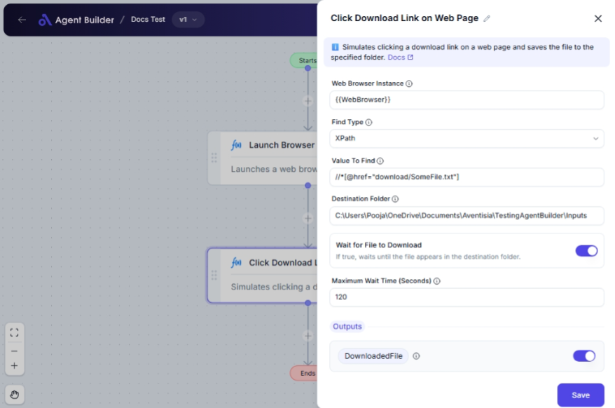

import { Callout, Steps } from "nextra/components";

# Click Download Link on Web Page

The **Click Download Link on Web Page** node automates the process of clicking on download links within a web page, facilitating the downloading of files directly to your specified folder. This is particularly useful in scenarios where you need to programmatically download reports, documents, or any files from web applications without manual intervention.

For example:

- Automatically download billing statements from an online portal.
- Retrieve latest version of a report available on a web page.
- Save attachments from web-based applications directly to a local folder.

## Configuration Options

| Field Name                      | Description                                                                       | Input Type | Required? | Default Value |
| ------------------------------- | --------------------------------------------------------------------------------- | ---------- | --------- | ------------- |
| **Web Browser Instance**        | Enter or choose the variable that contains the web browser instance to work with. | Text       | Yes       | _(empty)_     |
| **Find Type**                   | Specifies how to find the element (e.g., ID, XPath, CssSelector).                 | Select     | Yes       | XPath         |
| **Value To Find**               | The selector (XPath, ID, etc.) used to locate the download link on the page.      | Text       | Yes       | _(empty)_     |
| **Destination Folder**          | The full path of the folder where the downloaded file will be saved.              | Text       | Yes       | _(empty)_     |
| **Wait for File to Download**   | If true, waits until the file appears in the destination folder.                  | Switch     | No        | _(empty)_     |
| **Maximum Wait Time (Seconds)** | The maximum time to wait for the file to appear in the destination folder.        | Text       | No        | _(empty)_     |

## Expected Output Format

The output of this node is a **text string** that represents the full path of the downloaded file.

- **DownloadedFile**: Returns the path (e.g., `C:\Users\MyDocuments\Downloaded.pdf`).

## Step-by-Step Guide

<Steps>
### Step 1

Add **Click Download Link on Web Page** node into your automation flow.

### Step 2

In the **Web Browser Instance** field, enter or select the web browser instance variable you are working with.

### Step 3

Configure the **Find Type** dropdown to select the method of locating the download link (e.g., XPath or CSS Selector).

### Step 4

Enter the appropriate selector string in the **Value To Find** field based on your chosen find type.

### Step 5

Specify the full path in the **Destination Folder** where you want the downloaded file to be saved.

### Step 6

To ensure the downloaded file is tracked, optionally toggle the **Wait for File to Download** switch to true, and specify a **Maximum Wait Time** if needed.

### Step 7

Access the downloaded file's directory path returned as **DownloadedFile** for further processing in your automation tasks.

</Steps>

<Callout type="info" title="Tip">
  Use specific attributes in the **Value To Find** for more accurate and
  reliable link clicks.
</Callout>

## Input/Output Examples

| Find Type | Selector (Value To Find)   | Destination Folder   | Wait for Download | Max Wait Time | Output (Downloaded File)                 | Output Type |
| --------- | -------------------------- | -------------------- | ----------------- | ------------- | ---------------------------------------- | ----------- |
| XPath     | //a[@href='/files/report'] | C:\Downloads         | True              | 60            | C:\Downloads\report.pdf                  | Text String |
| Id        | downloadLink               | C:\Users\MyDocuments | False             | _(n/a)_       | C:\Users\MyDocuments\auto_downloaded.zip | Text String |

## Common Mistakes & Troubleshooting

| Problem                                    | Solution                                                                                                   |
| ------------------------------------------ | ---------------------------------------------------------------------------------------------------------- |
| **Element not found**                      | Ensure the correct Find Type and Value To Find are set. Double-check the selector path or attributes used. |
| **File not downloading**                   | Verify the web page's response and that the link points directly to the file for download.                 |
| **Timeout when waiting for file download** | Increase the maximum wait time if needed, based on the file size and network speed.                        |
| **Incorrect destination folder path**      | Double-check the folder path for spelling or permission issues.                                            |

## Real-World Use Cases

- **Automated Invoice Download**: Regularly click and download invoices from an online vendor portal for record-keeping.
- **Academic Research**: Automate the download of research papers and publications from various databases.
- **Reports Collection**: Gather daily or weekly analytical reports from web analytics tools automatically.
