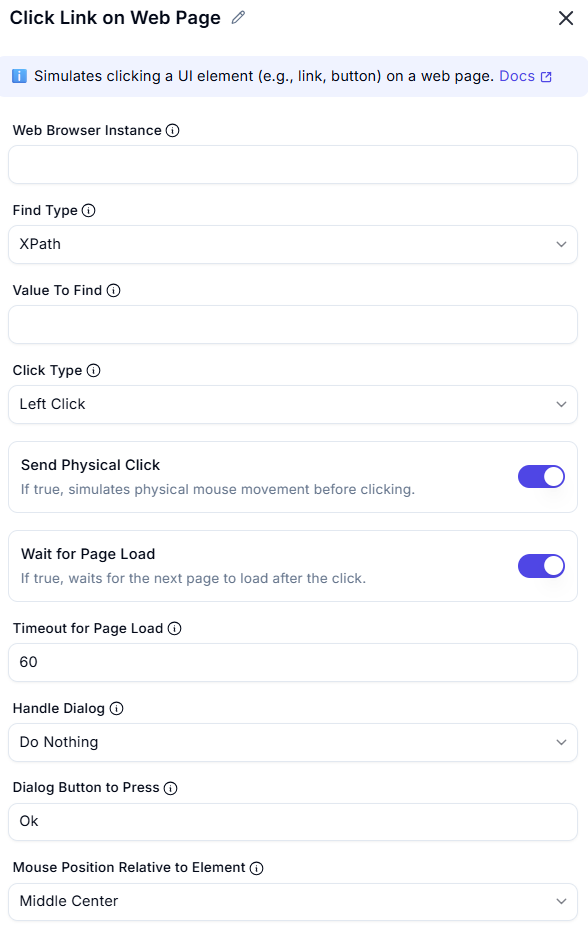

# Click Link on Web Page  

## Description
This action automates clicking on a specific link on a web page within a specified browser instance.  
It is useful for web automation tasks such as navigation, form submission, and interaction with web elements.  

    

## Fields and Options  

### 1. **Web Browser Instance**
- Select the active browser instance where the action should take place.  
- Ensures interaction occurs in the correct web session.  

### 2. **Find Type**
- Specify the UI element (link) to be clicked.  
- The element can be identified using selectors like XPath, CSS, or attributes.  

### 3. **Value To Find**
- Specify the UI element (link) to be clicked.  
- The element can be identified using selectors like XPath, CSS, or attributes.  

### 4. **Click Type**
- Choose the type of click action:  
  - **Left click** (default)  
  - **Right click**  
  - **Double click**  
- Allows flexibility depending on the type of interaction required.  

### 5. **Send Physical Click**
- If true, simulates physical mouse movement before clicking.

### 6. **Wait for Page Load**
- If true, waits for the next page to load after the click.

### 7. **Timeout for Page Load**
- The maximum time (in seconds) to wait for the page to load.

### 8. **Handle Dialog**
- Specifies what to do if a dialog appears after the click.

### 9. **Dialog Button to Press**
- The name of the button to press if a dialog appears (e.g., 'Ok', 'Cancel').

### 10. **Mouse Position Relative to Element**
- Specifies where to position the mouse relative to the element before clicking.

### 11. **Offset X**
- Move the mouse this many pixels horizontally from the selected position.

### 12. **Offset Y**
- Move the mouse this many pixels vertically from the selected position.

## Use Cases
- Navigating to different sections of a website.  
- Clicking buttons, links, or interactive elements on web pages.  
- Automating repetitive web tasks such as form submissions.  

## Summary
The **Click Link on Web Page** action enables seamless automation of web interactions.  
It provides precise control over link clicking, enhancing efficiency in browser automation.  