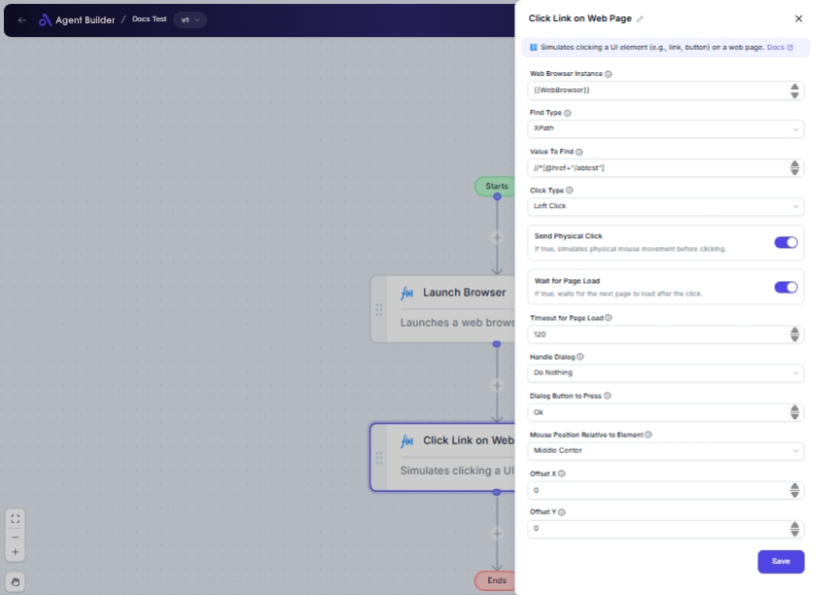

import { Callout, Steps } from "nextra/components";

# Click Link on Web Page

The **Click Link on Web Page** node allows you to automate the clicking of links or buttons on a web page within a specified browser instance. Use this node when you need to simulate user interaction by following links, logging into websites, navigating through forms, or initiating downloads.

For example:

- Navigate through a series of web pages automatically.
- Log in to an application by clicking the "submit" button.
- Download files by clicking on download links.

## Configuration Options

| Field Name                             | Description                                                                       | Input Type | Required? | Default Value |
| -------------------------------------- | --------------------------------------------------------------------------------- | ---------- | --------- | ------------- |
| **Web Browser Instance**               | Enter or choose the variable that contains the web browser instance to work with. | Text       | Yes       | _(empty)_     |
| **Find Type**                          | Specifies how to find the element (e.g., ID, XPath, CssSelector).                 | Select     | Yes       | XPath         |
| **Value To Find**                      | The selector used to locate the link or button on the web page.                   | Text       | Yes       | _(empty)_     |
| **Click Type**                         | Specifies the type of click to perform.                                           | Select     | No        | LeftClick     |
| **Send Physical Click**                | If true, simulates physical mouse movement before clicking.                       | Switch     | No        | true          |
| **Wait for Page Load**                 | If true, waits for the next page to load after the click.                         | Switch     | No        | true          |
| **Timeout for Page Load**              | The maximum time (in seconds) to wait for the page to load.                       | Text       | No        | 60            |
| **Handle Dialog**                      | Specifies what to do if a dialog appears after the click.                         | Select     | No        | DoNothing     |
| **Dialog Button to Press**             | The name of the button to press if a dialog appears (e.g., 'Ok', 'Cancel').       | Text       | No        | Ok            |
| **Mouse Position Relative to Element** | Specifies where to position the mouse relative to the element before clicking.    | Select     | No        | MiddleCenter  |
| **Offset X**                           | Move the mouse this many pixels horizontally from the selected position.          | Text       | No        | 0             |
| **Offset Y**                           | Move the mouse this many pixels vertically from the selected position.            | Text       | No        | 0             |

## Expected Output Format

The output of this node is **interaction completion status** which indicates whether the click was performed successfully and the subsequent actions (like page load) were completed.

## Step-by-Step Guide

<Steps>
### Step 1

Add **Click Link on Web Page** node into your automation flow.

### Step 2

In the **Web Browser Instance** field, enter or select the browser instance you target to interact with.

### Step 3

Choose the **Find Type** based on how you want to locate the link or button. For example, using **XPath** if you have an XPath expression.

### Step 4

Enter the specific selector value in the **Value To Find** field.

### Step 5

If necessary, adjust additional options such as **Click Type** for different click actions or **Send Physical Click** for simulating physical mouse movements.

### Step 6

Define any **Handle Dialog** preferences to manage pop-up dialogs that may appear after clicking.

### Step 7

If the mouse needs to be positioned precisely, use **Mouse Position Relative to Element** to set the position, with optional **Offset X** and **Offset Y** adjustments.

### Step 8

Once configured, the node will simulate the click based on your settings and complete the action of navigating or interacting with the web element.

</Steps>

<Callout type="info" title="Important Note">
  Ensure that the browser instance is properly initiated and connected before
  attempting to click, as the node operates within a provided instance.
</Callout>

## Common Mistakes & Troubleshooting

| Problem                                  | Solution                                                                                                                                    |
| ---------------------------------------- | ------------------------------------------------------------------------------------------------------------------------------------------- |
| **Incorrect Find Type or Value To Find** | Verify that the **Find Type** and **Value To Find** accurately correspond to the web element you wish to click.                             |
| **Click does not register**              | Check if **Send Physical Click** is needed to ensure the click is accurately registered on dynamic or complex web pages.                    |
| **Delay in page load**                   | Consider increasing the **Timeout for Page Load** to allow for slower network responses or complex page contents.                           |
| **Dialog not handled correctly**         | Confirm that **Handle Dialog** and **Dialog Button to Press** fields are correctly set to manage unexpected dialogs post-click effectively. |

## Real-World Use Cases

- **Automated Testing**: Validate web elements such as login buttons or navigation links during integration tests.
- **Web Scraping**: Navigate through web pages by simulating button clicks to gather data efficiently.
- **Online Interactions**: Automate login processes or submissions in repetitive web workflows, improving efficiency.
- **E-commerce Automation**: Quickly add items to a cart or proceed to checkout by simulating clicks on required buttons.
