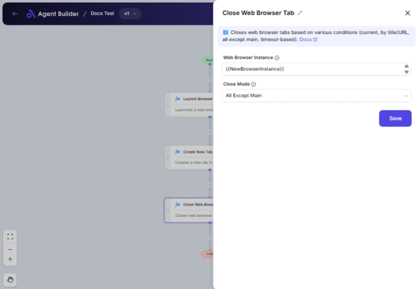

import { Callout, Steps } from "nextra/components";

# Close Web Browser Tab

The **Close Web Browser Tab** node allows you to programmatically close one or multiple browser tabs. This can be useful in a workflow where you need to focus on a specific tab, clean up your browser session by closing unnecessary tabs, or automate the closing of tabs after a certain condition or time.

For example:

- Closing the currently active tab after completing an interaction.
- Automatically closing tabs that match certain criteria like URL or title.
- Keeping the main tab open while closing others to declutter your browser.
- Closing a tab after a predefined timeout.

{/*  */}

## Configuration Options

| Field Name               | Description                                                                                  | Input Type | Required? | Default Value |
| ------------------------ | -------------------------------------------------------------------------------------------- | ---------- | --------- | ------------- |
| **Web Browser Instance** | The WebDriver instance containing the browser session.                                       | Text       | Yes       | _(empty)_     |
| **Close Mode**           | Specifies how to close the tab(s): Current, By Title/URL, All Except Main, or After Timeout. | Select     | No        | Current       |
| **Match Type**           | Select whether to match by URL or Title when using 'ByTitleOrUrl' mode.                      | Text       | No        | _(empty)_     |
| **Match Criteria**       | Enter the URL or Title to match when using 'ByTitleOrUrl' mode.                              | Text       | No        | _(empty)_     |
| **Timeout Seconds**      | Maximum time in seconds before closing the tab automatically in 'After Timeout' mode.        | Text       | No        | 60            |

## Expected Output Format

The output of this node is a confirmation message indicating whether the tab(s) were successfully closed, which is a simple human-readable text message.

## Step-by-Step Guide

<Steps>
### Step 1

Add **Close Web Browser Tab** node into your flow.

### Step 2

In the **Web Browser Instance** field, enter the identifier for the WebDriver instance that manages your browser session.

### Step 3

Select a **Close Mode** from the dropdown that suits your requirements:

- **Current**: Closes the currently active tab.
- **By Title or URL**: Allows you to specify criteria to close tab(s) matching a URL or title.
- **All Except Main**: Closes all tabs, leaving the main one open.
- **After Timeout**: Closes the tab after a specified timeout period.

### Step 4

If you choose **By Title or URL**:

- Enter a **Match Type** to specify whether the match should be by URL or Title.
- Specify the **Match Criteria** that the tab(s) must meet to be closed.

### Step 5

If you choose **After Timeout**, enter the **Timeout Seconds** for how long the tab will remain open before closing.

### Step 6

The action will close the tab(s) as specified, and you will receive a confirmation message.

</Steps>

<Callout type="info" title="Tip">
  For modes other than "Current", ensure the appropriate additional fields (like
  "Match Criteria" for "By Title or URL") are correctly populated to work
  successfully.
</Callout>

## Input/Output Examples

| Close Mode      | Match Type | Match Criteria | Timeout Seconds | Example Scenario                                                                         |
| --------------- | ---------- | -------------- | --------------- | ---------------------------------------------------------------------------------------- |
| Current         | _(n/a)_    | _(n/a)_        | _(n/a)_         | The currently open tab is closed immediately.                                            |
| By Title or URL | URL        | "example.com"  | _(n/a)_         | Closes tab(s) whose URLs contain "example.com".                                          |
| All Except Main | _(n/a)_    | _(n/a)_        | _(n/a)_         | All tabs except the main one are closed.                                                 |
| After Timeout   | _(n/a)_    | _(n/a)_        | 30              | The active tab closes automatically after 30 seconds if not closed manually before that. |

## Common Mistakes & Troubleshooting

| Problem                                          | Solution                                                                                                                |
| ------------------------------------------------ | ----------------------------------------------------------------------------------------------------------------------- |
| **No tabs are closing**                          | Ensure the correct **Web Browser Instance** is used and valid closed mode settings are applied.                         |
| **Match Type and Match Criteria not showing up** | These fields are only visible when **Close Mode** is set to **By Title or URL**. Ensure the mode is selected correctly. |
| **Tab doesn't close on timeout**                 | Verify that the **Timeout Seconds** value is set and the browser session is active.                                     |

## Real-World Use Cases

- **Automated Testing**: Close browser tabs post-test execution to clean up.
- **E-commerce Sites**: Close promotional tabs automatically based on URL matching post-click.
- **Multitasking**: Programmatically manage which tabs to keep open, aiding in focus-centric workflows.
- **Timeout Scenarios**: Automate closing tabs after interacting with information that expires after a certain time (e.g., live feeds).
