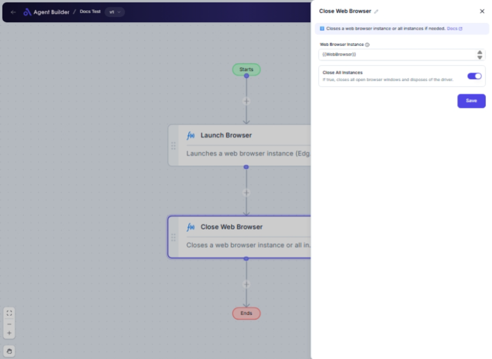

import { Callout, Steps } from "nextra/components";

# Close Web Browser

The **Close Web Browser** node is designed to automate the closure of a web browser session. This is particularly useful for ensuring that your automated workflows do not leave browser instances running, which could consume unnecessary resources. Use this node at the end of your automation process to ensure a clean shutdown of the browser.

Common scenarios include:

- Cleaning up after performing web-based automation tasks.
- Ensuring browser sessions are properly closed to free up system resources.
- Closing all open browser windows in case multiple sessions were launched.

 

## Configuration Options

| Field Name               | Description                                                                                      | Input Type | Required? | Default Value |
| ------------------------ | ------------------------------------------------------------------------------------------------ | ---------- | --------- | ------------- |
| **Web Browser Instance** | The specific browser session you wish to close.                                                  | Text       | Yes       | _(empty)_     |
| **Close All Instances**  | Toggle to close all open browser windows if set to true, and also dispose of the driver session. | Switch     | No        | _(off)_       |

## Expected Output Format

The node produces no direct output value but closes the referenced browser session. The main effect is the closure of the browser, which doesn't provide an output value for further nodes in your flow.

## Step-by-Step Guide

<Steps>

### Step 1

Add **Close Web Browser** node into your flow after tasks that require the browser.

### Step 2

In the **Web Browser Instance** field, specify the browser session you want to close. Use the name of the session you have been working with.

### Step 3

If you want to close all open browser windows, set **Close All Instances** to "On".

### Step 4

Complete your flow by making sure other necessary steps are configured before closing the browser.

</Steps>

<Callout type="info" title="Tip">
  Be cautious with enabling "Close All Instances" if you have other browser
  windows you wish to remain open as it will close all sessions.
</Callout>

## Input/Output Examples

There are no direct input/output examples for this node as its primary function is to close the browser. It affects the state of the web browser rather than producing a data output.

## Common Mistakes & Troubleshooting

| Problem                                      | Solution                                                                                 |
| -------------------------------------------- | ---------------------------------------------------------------------------------------- |
| **Browser does not close**                   | Ensure you have correctly specified the **Web Browser Instance** that you want to close. |
| **Unintended closure of browser sessions**   | Do not enable **Close All Instances** unless you intend to close all browser windows.    |
| **Failure when browser instance is invalid** | Double-check the browser instance name to ensure it exists and is currently active.      |

## Real-World Use Cases

- **End of Web Data Scraping Session**: Concludes a data scraping automation by closing the browser to conserve resources.
- **After Completing Automated Tests**: Shuts down all browser instances post-testing to start fresh with future tests.
- **System Resource Management**: Frees up system resources by ensuring no lingering browser windows remain open after automations.
