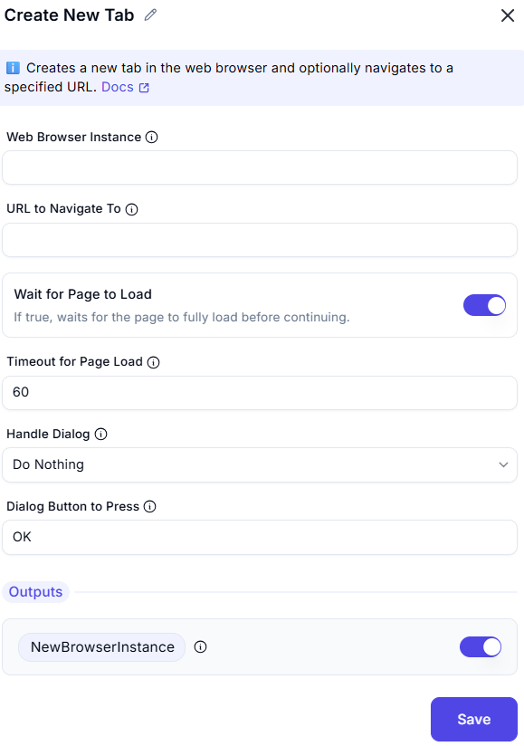

# Create New Tab  

## Description
This feature allows users to open a new tab in an existing web browser instance and navigate to a specified URL.  
It is useful for automating web-based workflows without opening a completely new browser window.  

  

## Fields and Options  

### 1. **Web Browser Instance**
- Select the browser instance where the new tab should be opened.  
- This ensures the new tab is created within the correct automation session.  

### 2. **URL to Navigate To**
- Specify the URL to open in the new tab.  
- Example: `https://www.google.com`  

### 3. **Wait for Page to Load: enable**
- If true, waits for the page to fully load before continuing.

### 4. **Timeout for Page Load: 60**
- Maximum time (in seconds) to wait for the page to load.

### 5. **Handle Dialog**
- Specifies what to do if a dialog appears after navigating.
- Do Nothing
- Close it
- Press a Button

### 6. **Dialog Button to Press**
- The button to press if a dialog appears (e.g., 'OK', 'Cancel').

### 7. **Outputs**
- **NewBrowserInstance** Returns the newly created browser tab/window as an IWebDriver instance.

## Use Cases
- Opening multiple web pages for automated data extraction.  
- Logging into different websites in separate tabs.  
- Automating workflows that require interaction with multiple web pages.  

## Summary
The **Create New Tab** action is a powerful automation feature that streamlines web-based tasks.  
It enables users to efficiently manage browser tabs and automate navigation seamlessly.  