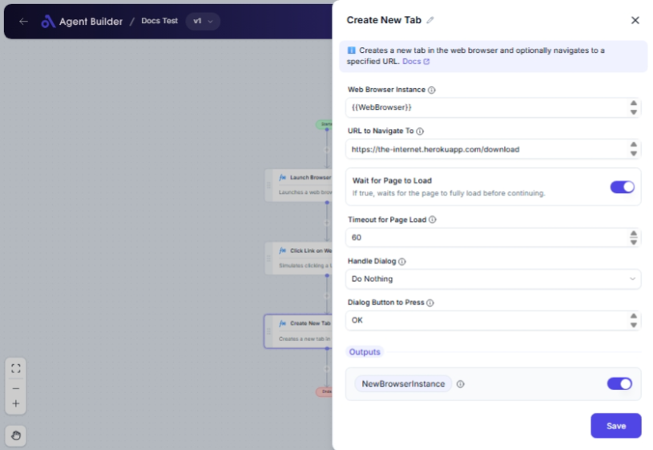

import { Callout, Steps } from "nextra/components";

# Create New Tab

The **Create New Tab** node allows you to open a new tab in an existing web browser session, with the option to navigate directly to a specified URL. This can be particularly useful when you need to multitask, such as opening multiple tabs for data entry, research, or monitoring different web pages without disrupting your current workflow.

For example:

- Initiate a new tab to perform a search on another site while reviewing an article in your current browser tab.
- Open a new tab for filling out an online form while keeping your original tab intact for reference.

## Configuration Options

| Field Name                 | Description                                                                       | Input Type | Required? | Default Value |
| -------------------------- | --------------------------------------------------------------------------------- | ---------- | --------- | ------------- |
| **Web Browser Instance**   | Enter or choose the variable that contains the web browser instance to work with. | Text       | Yes       | _(empty)_     |
| **URL to Navigate To**     | The URL to navigate to after creating the new tab.                                | Text       | No        | _(empty)_     |
| **Wait for Page to Load**  | If true, waits for the page to fully load before continuing.                      | Switch     | No        | true          |
| **Timeout for Page Load**  | Maximum time (in seconds) to wait for the page to load.                           | Text       | No        | 60            |
| **Handle Dialog**          | Specifies what to do if a dialog appears after navigating.                        | Select     | No        | DoNothing     |
| **Dialog Button to Press** | The button to press if a dialog appears (e.g., 'OK', 'Cancel').                   | Text       | No        | OK            |

## Expected Output Format

This node outputs a **New Browser Instance**, which is a reference to the newly created browser tab or window as an IWebDriver instance.

## Step-by-Step Guide

<Steps>
### Step 1

Add **Create New Tab** node to your workflow.

### Step 2

In the **Web Browser Instance** field, enter or select the variable name for the current web browser session you wish to add a tab to.

### Step 3

In the **URL to Navigate To** field, specify the desired web address you want the new tab to open (optional).

### Step 4

Enable **Wait for Page to Load** if you want to pause the workflow until the page is fully loaded. This option ensures all content is ready before proceeding.

### Step 5

Set **Timeout for Page Load** to determine how many seconds the platform should wait before timing out.

### Step 6

Select an option from **Handle Dialog** to define how unexpected pop-up dialogs should be handled (optional). Options include:

- **Do Nothing**: Ignores dialogs.
- **Close It**: Closes any dialogs automatically.
- **Press a Button**: Presses a specified button on the dialog.

### Step 7

If **Press a Button** is selected in the previous step, specify **Dialog Button to Press** with the button label (e.g., 'OK').

### Step 8

The new tab instance will be saved as **NewBrowserInstance** for further interaction in your process.

</Steps>

<Callout type="info" title="Tip">
  If no URL is specified, the new tab will open with the default homepage or
  remain blank, depending on the browser settings.
</Callout>

## Input/Output Examples

| Action       | Input Instance | URL Entered         | Handle Dialog | Output Instance    | Output Type         |
| ------------ | -------------- | ------------------- | ------------- | ------------------ | ------------------- |
| Open new tab | Browser1       | https://example.com | Do Nothing    | NewBrowserInstance | IWebDriver Instance |

## Common Mistakes & Troubleshooting

| Problem                                           | Solution                                                                                                                                                             |
| ------------------------------------------------- | -------------------------------------------------------------------------------------------------------------------------------------------------------------------- |
| **Web Browser Instance not recognized**           | Ensure you entered the correct variable representing your current browser session.                                                                                   |
| **URL not loading**                               | Check for typos in the URL and verify the site is accessible. Consider using a complete URL with "http://" or "https://".                                            |
| **Unexpected dialog interfering with automation** | Confirm the **Handle Dialog** setting is configured, especially if unpredictable pop-ups occur. Specify the required button in **Dialog Button to Press** if needed. |

## Real-World Use Cases

- **Market Research**: Easily open tabs for competitor sites or resources while compiling data in your main browser tab.
- **Customer Service**: Access new disaster relief resource pages or updates quickly without leaving existing case tools.
- **Form Automation**: Quickly switch to submission pages while keeping guideline tabs active for fast reference.
