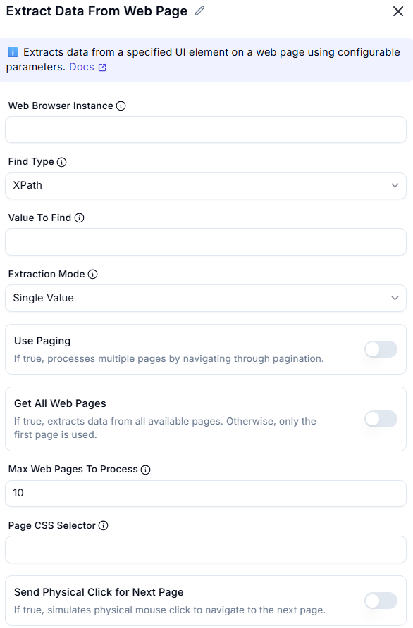
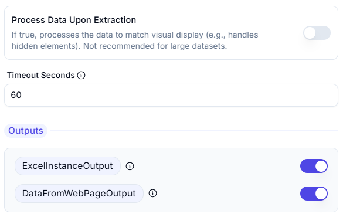

# Extract Data from Web Page  

## Description
This feature allows users to extract data from a web page using a web browser instance and specific UI elements. It supports advanced options like pagination and CSS selectors for precise data extraction.  

 

## Fields and Options  

### 1. Web Browser Instance
- Select the web browser instance from which to extract data.  
- This ensures the action is performed on the correct browser session.  

### 2. Find Type
- Define the type of data to extract (e.g., text, attribute, HTML content).  

### 3. Value To Find
- Specify the UI element on the web page from which to extract data (e.g., table, list, text).  

### 4. Extraction Mode
- Specifies what type of data to extract (e.g., single value, list, table).

### 5. Use Paging
- If true, processes multiple pages by navigating through pagination. 

### 6. Get All Web Pages
- If true, extracts data from all available pages. Otherwise, only the first page is used.

### 7. Max Web Pages to Process
- The maximum number of web pages to process when using 'Use Paging'.

### 8. Page CSS Selector
- CSS selector used to locate the next page navigation element.

### 9. Send Physical Click for Next Page
- If true, simulates physical mouse click to navigate to the next page.

### 10. Process Data Upon Extraction
- If true, processes the data to match visual display (e.g., handles hidden elements). Not recommended for large datasets.

### 11. Timeout Seconds
- Maximum time in seconds to wait for an element before failing.

## Outputs
- **ExcelInstanceOutput** Returns the Excel instance if storing data in Excel.
- **DataFromWebPageOutput** Returns the extracted data as a single value, list, data row, or data table
## Use Cases
- Extracting data from tables, lists, or specific elements on a web page.  
- Automating data collection from paginated web pages.  
- Scraping dynamic content from websites for analysis or storage.  

## Summary
The **Extract Data from Web Page** action provides a way to extract data from web pages using a web browser instance and specific UI elements. It supports advanced features like pagination and CSS selectors, making it ideal for web scraping and data collection tasks.