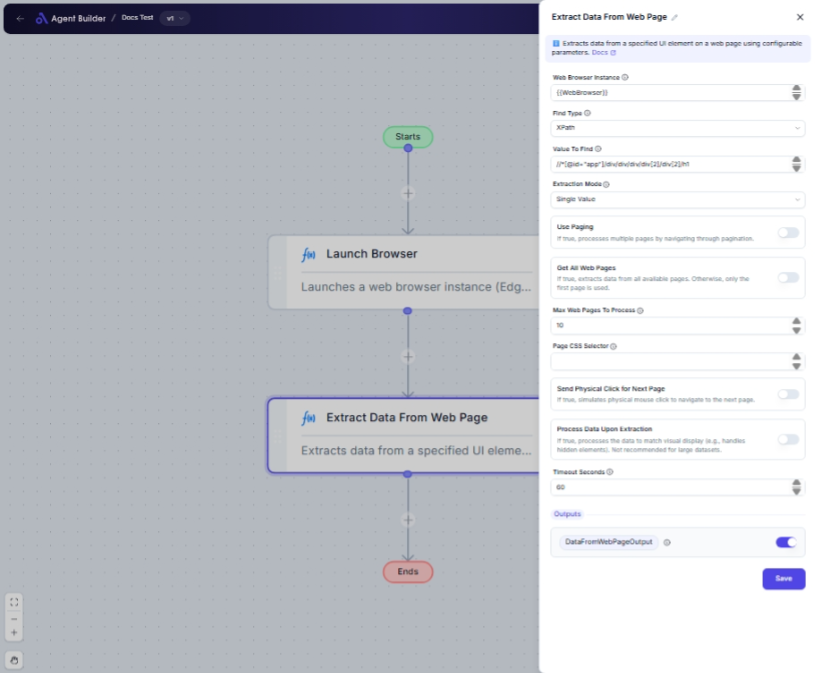

import { Callout, Steps } from "nextra/components";

# Extract Data From Web Page

The **Extract Data From Web Page** node allows you to automatically gather and capture information from web pages using a web browser. This is particularly useful for processes such as data gathering for analysis, conducting web research, or extracting data from online reports and tables.

This node ensures that relevant web elements are pinpointed using various selection methods, and the necessary data is captured based on your extraction preferences.

{/*  */}

## Configuration Options

| Field Name                            | Description                                                                              | Input Type | Required? | Default Value |
| ------------------------------------- | ---------------------------------------------------------------------------------------- | ---------- | --------- | ------------- |
| **Web Browser Instance**              | Enter or choose the variable that contains the web browser instance to work with.        | Text       | Yes       | _(empty)_     |
| **Find Type**                         | Specifies how to find the element (e.g., ID, XPath, CssSelector).                        | Select     | No        | XPath         |
| **Value To Find**                     | The selector used to locate the link or button on the web page.                          | Text       | No        | _(empty)_     |
| **Extraction Mode**                   | Specifies what type of data to extract (e.g., single value, list, table).                | Select     | No        | SingleValue   |
| **Use Paging**                        | If true, processes multiple pages by navigating through pagination.                      | Switch     | No        | _(empty)_     |
| **Get All Web Pages**                 | If true, extracts data from all available pages. Otherwise, only the first page is used. | Switch     | No        | _(empty)_     |
| **Max Web Pages To Process**          | The maximum number of web pages to process when using 'Use Paging'.                      | Text       | No        | 10            |
| **Page CSS Selector**                 | CSS selector used to locate the next page navigation element.                            | Text       | No        | _(empty)_     |
| **Send Physical Click for Next Page** | If true, simulates physical mouse click to navigate to the next page.                    | Switch     | No        | _(empty)_     |
| **Process Data Upon Extraction**      | If true, processes the data to match visual display (e.g., handles hidden elements).     | Switch     | No        | _(empty)_     |
| **Timeout Seconds**                   | Maximum time in seconds to wait for an element before failing.                           | Text       | No        | 60            |

## Expected Output Format

The output of this node can be various data types depending on the extraction mode selected:

- **Single Value**: Returns a single text value.
- **List**: Provides a list of text values.
- **Table** or **Entire HTML Table**: Returns data as tabular records.

The extracted data is obtained in the format specified by the **Extraction Mode**:

- **ExcelInstanceOutput**: If storing data in Excel, this output provides the Excel instance.
- **DataFromWebPageOutput**: Contains the extracted data as a single value, list, data row, or data table.

## Step-by-Step Guide

<Steps>
### Step 1

Add the **Extract Data From Web Page** node to your flow.

### Step 2

In the **Web Browser Instance** field, specify or select the variable associated with the browser you want to use.

### Step 3

Set a method to locate the element by choosing an option in the **Find Type** dropdown, such as XPath, ID, or CSS selector.

### Step 4

(If needed) Provide a specific **Value To Find** which serves as the selector for locating elements.

### Step 5

Select the preferred **Extraction Mode** from the dropdown to define the type of data you wish to extract.

### Step 6

Configure **Use Paging** and related fields if you intend to navigate through multiple pages and extract data.

### Step 7

Set the **Timeout Seconds** to define the maximum waiting period for element interaction.

### Step 8

Processed data or the direct extraction will be available as **DataFromWebPageOutput** or stored in Excel if configured.

</Steps>

<Callout type="info" title="Note">
  Be sure to select a **Find Type** that matches the characteristic of the web
  element you wish to interact with for achieving accurate extraction results.
</Callout>

## Input/Output Examples

| Find Type   | Value To Find        | Extraction Mode | Output Value                            | Output Type  |
| ----------- | -------------------- | --------------- | --------------------------------------- | ------------ |
| XPath       | //div[@class='info'] | Single Value    | "Product Info: ABC"                     | Text         |
| CssSelector | .price               | List            | ["$199", "$299", "$399"]                | List of Text |
| TagName     | table                | Table           | [["Name", "Price"], ["Widget", "$199"]] | Data Table   |

## Common Mistakes & Troubleshooting

| Problem                             | Solution                                                                                                                            |
| ----------------------------------- | ----------------------------------------------------------------------------------------------------------------------------------- |
| **Unable to Locate Element**        | Ensure the **Find Type** and **Value To Find** correctly match the web page element properties.                                     |
| **No Data Extracted on Pagination** | Verify if continuation conditions for **Use Paging** are set and ensure **Page CSS Selector** correctly identifies the next button. |
| **Timeout Errors on Extraction**    | Increase the **Timeout Seconds** or verify network stability if frequent execution delays occur.                                    |

## Real-World Use Cases

- **Market Research**: Extracts competitor pricing details from retail platforms.
- **Content Aggregation**: Gathers articles or blog posts from websites based on specific categories.
- **Data Analysis**: Collects financial or product data for use in analytics or reporting.
- **Academic Research**: Automate the collection of research papers or study materials from online resources.
