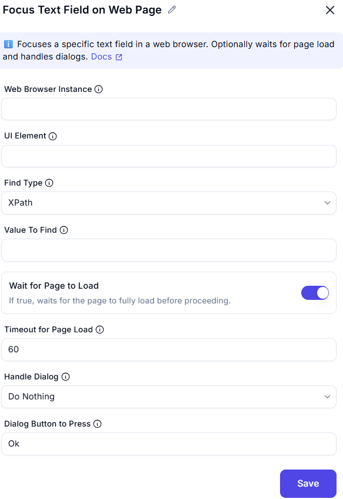

# Focus Text Field on Web Page  

## Description
This feature allows users to focus on a specific text field (UI element) on a web page within a web browser instance. It includes options to wait for the page to load and handle pop-up dialogs if they appear.  

  

## Fields and Options  

### 1. Web Browser Instance
- Select the web browser instance where the text field is located.  
- This ensures the action is performed on the correct browser session.  

### 2. UI Element
- Specify the text field (UI element) to focus on (e.g., input field, search box).  

### 2. Find Type
- Specifies how to find the element (e.g., ID, XPath, CssSelector).  

### 4. Value To Find
- The value used to locate the element (e.g., 'username', '//input[@id='email']').

### 3. Wait for Page to Load
- If true, waits for the page to fully load before proceeding.

### 4. Timeout for Webpage to Load
- Set the maximum time (in seconds) to wait for the page to load (e.g., `60` seconds).  

### 5. Handle Dialog
- Choose how to handle pop-up dialogs:  
  - **Do Nothing**: Ignore the pop-up dialog.  
  - **Dialog Button to Press**: Specify a button to press on the pop-up dialog (e.g., `OK`, `Cancel`).  

## Use Cases
- Automating form filling by focusing on specific text fields.  
- Ensuring the web page is fully loaded before interacting with a text field.  
- Handling pop-up dialogs that may appear during the process.  

## Summary
The **Focus Text Field on Web Page** action provides a way to focus on a specific text field on a web page, with options to wait for the page to load and handle pop-up dialogs. It ensures smooth and reliable interaction with web elements during automation workflows.  