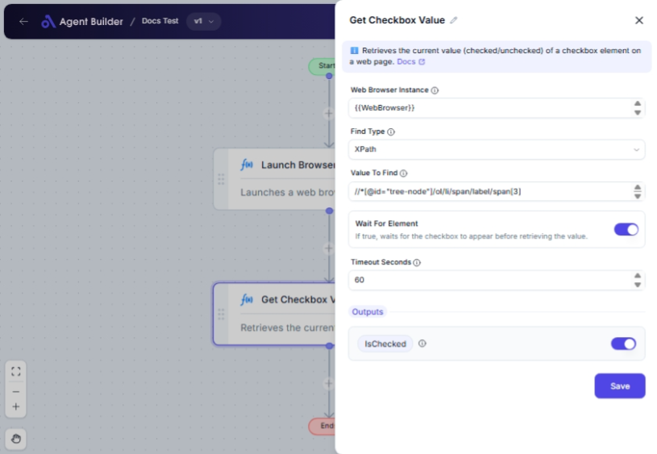

import { Callout, Steps } from "nextra/components";

# Get Checkbox Value

The **Get Checkbox Value** node is used to determine whether a checkbox element on a web page is checked or unchecked. This can be particularly useful when you need to validate user input, update data based on user preferences, or ensure certain conditions are met before proceeding in an automation process.

For example:

- Checking if a terms and conditions box is selected before submitting a form.
- Validating user preferences in a settings page.

## Configuration Options

| Field Name               | Description                                                                                 | Input Type | Required? | Default Value |
| ------------------------ | ------------------------------------------------------------------------------------------- | ---------- | --------- | ------------- |
| **Web Browser Instance** | The web browser instance variable to use for retrieving the checkbox value.                 | Text       | Yes       | _(empty)_     |
| **Find Type**            | Specifies the method for locating the checkbox element (e.g., ID, XPath, CssSelector).      | Select     | Yes       | XPath         |
| **Value To Find**        | The specific value or locator used to find the checkbox element.                            | Text       | Yes       | _(empty)_     |
| **Wait For Element**     | When enabled, waits for the checkbox element to appear before trying to retrieve its value. | Switch     | No        | _(empty)_     |
| **Timeout Seconds**      | The maximum time, in seconds, to wait for the element to appear.                            | Text       | No        | 60            |

## Expected Output Format

The output of this node is a **boolean value** (`true` or `false`).

- Output Name: **IsChecked**
- Description: Returns `true` if the checkbox is checked, and `false` if unchecked.

## Step-by-Step Guide

<Steps>
### Step 1

Add **Get Checkbox Value** node into your flow.

### Step 2

In the **Web Browser Instance** field, enter the variable that holds your web browser instance.

### Step 3

Select the method to locate the checkbox in the **Find Type** dropdown (e.g., XPath or CSS Selector).

### Step 4

In the **Value To Find** field, provide the specific locator value to find your checkbox element (e.g., an XPath expression).

### Step 5

If necessary, toggle **Wait For Element** to wait for the checkbox to appear before retrieving its status.

### Step 6

If **Wait For Element** is enabled, specify the maximum wait time in **Timeout Seconds** (default: 60 seconds).

### Step 7

The checkbox status will be available as **IsChecked**, returning either `true` or `false`.

</Steps>

<Callout type="info" title="Tip">
  Ensure the correct locator is used in **Value To Find** for accurate results.
  The locator should be unique to the checkbox element.
</Callout>

## Input/Output Examples

| Find Type | Value To Find             | Wait For Element | Timeout Seconds | IsChecked | Output Type |
| --------- | ------------------------- | ---------------- | --------------- | --------- | ----------- |
| XPath     | //input[@type='checkbox'] | true             | 30              | true      | Boolean     |
| Id        | consent-checkbox          | false            | _(n/a)_         | false     | Boolean     |

## Common Mistakes & Troubleshooting

| Problem                  | Solution                                                                                                 |
| ------------------------ | -------------------------------------------------------------------------------------------------------- |
| **Checkbox not found**   | Verify that the **Value To Find** is correct and that it uniquely identifies the checkbox element.       |
| **Timeout error**        | Increase **Timeout Seconds** if the checkbox takes longer to appear than the specified time.             |
| **Wrong checkbox state** | Double-check if other checkboxes share similar attributes, which might lead to incorrect identification. |

## Real-World Use Cases

- **Form Submissions**: Ensure all necessary checkboxes are selected (e.g., terms of service) before allowing form submission.
- **User Preferences**: Collect user settings from a preferences page to customize their experience.
- **Automated Testing**: Validate that default settings or conditions are correctly applied in web applications.
