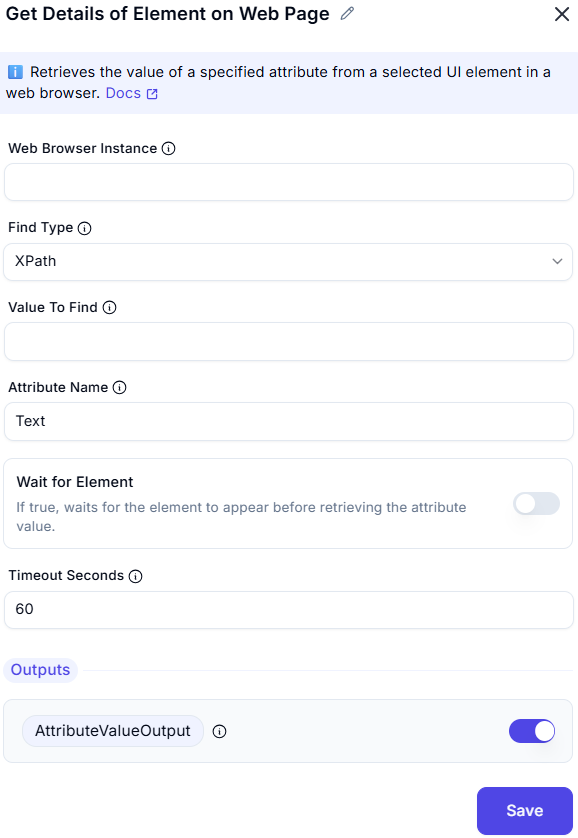

# Get Details of Element on Web Page  

## Description
This feature allows users to retrieve specific details of a UI element on a web page, such as its attribute value or text content. It is useful for extracting data from web elements during automation workflows.  

  

## Fields and Options  

### 1. Web Browser Instance
- Select the web browser instance where the UI element is located.  
- This ensures the action is performed on the correct browser session.  

### 2. Find Type
- Specify the UI element from which to retrieve details (e.g., button, input field, link).  

### 3. Value To Find
- The value used to locate the element (e.g., 'username', '//input[@id='email']').

### 3. Attribute Name
- Enter the name of the attribute to retrieve (e.g., `href`, `class`, `value`).  

### 4. Wait for Element
- Enable this option to retrieve the text content of the UI element.  
- If true, waits for the element to appear before retrieving the attribute value.

### 5. Timeout Seconds
- Maximum time in seconds to wait for the element before failing.

### 6. Output: AttributeValue
- Retrieves the value of the specified attribute for the UI element.  

## Use Cases
- Extracting attribute values (e.g., `href`, `class`) from web elements.  
- Retrieving text content from buttons, links, or other UI elements.  
- Collecting data from web elements for analysis or further processing.  

## Summary
The **Get Details of Element on Web Page** action provides a way to retrieve specific details of a UI element, such as attribute values or text content. It ensures precise extraction of data from web elements, making it ideal for web automation and data collection tasks.