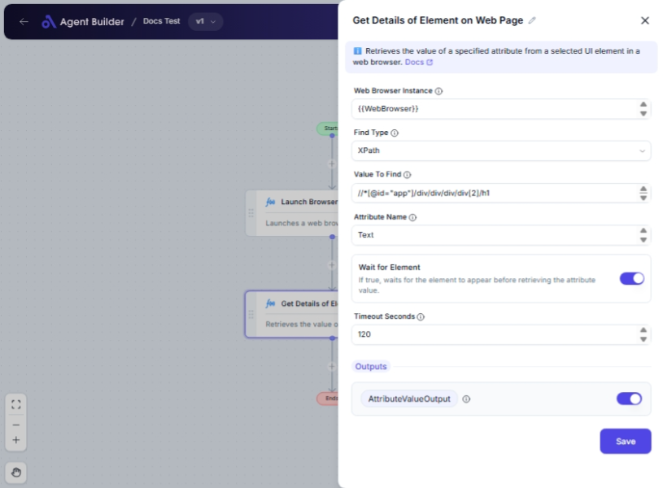

import { Callout, Steps } from "nextra/components";

# Get Details of Element on Web Page

The **Get Details of Element on Web Page** node is designed to help you extract information from a web element within a browser instance. This is useful for tasks such as web scraping, automated testing, or any scenario where you need to retrieve specific attribute data from elements on websites dynamically. By specifying how you want to locate an element and which attribute you're interested in, this node helps automate the data retrieval process effortlessly.

{/*  */}

## Configuration Options

| Field Name               | Description                                                                              | Input Type | Required? | Default Value |
| ------------------------ | ---------------------------------------------------------------------------------------- | ---------- | --------- | ------------- |
| **Web Browser Instance** | Enter or choose the variable containing the web browser instance to work with.           | Text       | Yes       | _(empty)_     |
| **Find Type**            | Specifies how to find the element (e.g., ID, XPath, CssSelector).                        | Select     | Yes       | XPath         |
| **Value To Find**        | The value used to locate the element (e.g., 'username', '//input[@id='email']').         | Text       | Yes       | _(empty)_     |
| **Attribute Name**       | The name of the attribute whose value should be retrieved. Use 'Text' to get inner text. | Text       | Yes       | Text          |
| **Wait for Element**     | If true, waits for the element to appear before retrieving the attribute value.          | Switch     | No        | _(empty)_     |
| **Timeout Seconds**      | Maximum time in seconds to wait for the element before failing.                          | Text       | No        | 60            |

## Expected Output Format

The output of this node is a **string value** representing the attribute value you requested from the web element.

- The output will be provided as `AttributeValueOutput`, and it can be any textual content based on the attribute like text or inner text.

## Step-by-Step Guide

<Steps>
### Step 1

Add the **Get Details of Element on Web Page** node into your workflow.

### Step 2

In the **Web Browser Instance** field, specify the variable containing your web browser instance.

### Step 3

Select the **Find Type** method to locate the web element:

- Options include methods like XPath, ID, CssSelector, and more. Choose based on the structure of the webpage.

### Step 4

Enter the **Value To Find** corresponding to your chosen Find Type. For example, an XPath expression or an HTML ID.

### Step 5

Specify the **Attribute Name** (e.g., `Text`) you wish to retrieve from the web element.

### Step 6

(Optional) Toggle **Wait for Element** if you want the workflow to wait for the element to appear.

### Step 7

(Optional) Set **Timeout Seconds** for how long you should wait for the element to appear before failing the task.

### Step 8

The attribute value will be outputted as **AttributeValueOutput** for further use in your workflow.

</Steps>

<Callout type="info" title="Tip">
  Ensure the **Web Browser Instance** is correctly initialized and matches the
  relevant webpage context for this operation.
</Callout>

<Callout type="warning" title="Important">
  Incorrect **Find Type** or **Value To Find** inputs may lead to failure in
  locating the element. Double-check the webpage's structure to ensure accuracy.
</Callout>

## Common Mistakes & Troubleshooting

| Problem                | Solution                                                                                                                                                          |
| ---------------------- | ----------------------------------------------------------------------------------------------------------------------------------------------------------------- |
| **Element Not Found**  | Verify that the Find Type and Value To Find correctly describe the element's location and structure. Consider increasing the timeout if the element appears late. |
| **Empty Output Value** | Ensure the Attribute Name is correct and corresponds to an existing attribute of the element.                                                                     |

## Real-World Use Cases

- **Web Scraping**: Automatically extract price information from product listings on e-commerce sites.
- **Automated Testing**: Validate whether certain elements or attributes are present and correctly set before proceeding with test cases.
- **Data Aggregation**: Collect and analyze textual content like headlines, descriptions, or user reviews from multiple web pages.
